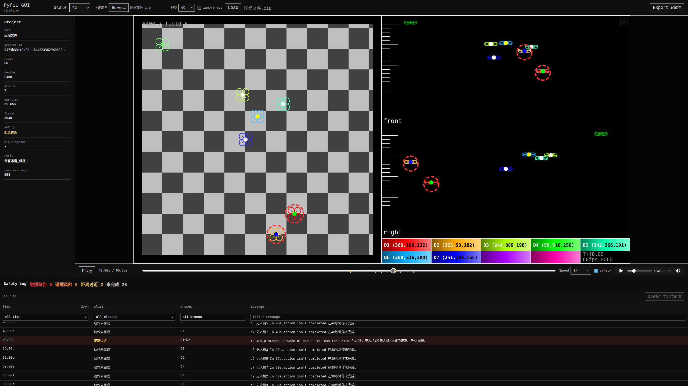

# Pyfii

## 简介

这个库的功能是可以让我们用 python 写 Fii 的无人机程序，以解决原软件无运算能力，无循环模块，一块块拖太烦等问题。此外，这个库有三视图模拟飞行的功能，模拟飞行更方便观看。

### Pyfii GUI（网页版）

`apps/pyfii-gui/` 是 pyfii 的 Web GUI，已成功部署上线：**[pyfii.cn](https://pyfii.cn/)**



支持功能：

- **二维三视图模拟**：top / front / right 三个视角实时预览无人机编队飞行轨迹
- **加速度感知模拟**：模拟基于实际加速度数据，真实还原无人机飞行动态
- **清晰的报错展示**：安全距离检测结果按四类分级展示（距离过近 / 碰撞风险 / 碰撞警告），支持按列筛选和排序，点击事件可跳转到对应时间点
- 上传 Fii 项目 zip，浏览器端完成轨迹解析、安全分析和可视化预览
- 支持 Three.js 3D 模式，正交/透视相机切换，鼠标拖动转动视角

GUI 作为 pyfii core 的上层应用，依赖方向为：

```text
pyfii-gui -> pyfii core
```

FastAPI、Vue、Vite 等 GUI 依赖都放在 `apps/pyfii-gui/` 下，不放进 `src/pyfii/`。详细启动和部署说明见 [apps/pyfii-gui/README.md](apps/pyfii-gui/README.md)。

## 安装
1. 使用 pip install 安装

    在命令行输入

        pip install pyfii

2. 下载源代码

    在命令行输入

        git clone https://github.com/Kevin0412/pyfii.git

    pyfii 就会被下载到当前目录下，使用时将 pyfii 文件夹复制到项目目录下

## 文档索引

如果你的目标不是简单使用 pyfii，而是想复刻整个项目，请优先阅读 [内部原理](doc/tutorial/principle.md)。

- [安装说明](doc/tutorial/install.md)
- [教程目录](doc/tutorial/contents.md)
- [编队飞行](doc/tutorial/group_flight.md)
- [编程挑战](doc/tutorial/programme_challenge.md)
- [脚本模式](doc/tutorial/script_mode.md)
- [内部原理](doc/tutorial/principle.md)
- [进阶用法](doc/tutorial/more.md)
- [灯光编写](doc/tutorial/light.md)
- [Pyfii GUI 原型](doc/pyfii_gui.md)
- [AI 编舞探索](doc/ai_choreography_exploration.md)

## 目录结构说明

    src/pyfii
    ├── cv3d
    │   ├── IIID2.py
    │   ├── IIID.py
    │   └── transfer.py
    ├── drone.py
    ├── fii.py
    ├── __init__.py
    ├── read.py
    └── show.py

项目结构 (核心部分) 如上图

其中 cv3d 是使用 OpenCV 实现的 3d 图形库

drone.py 定义了 Drone 类，实现无人机的基本指令

fii.py 定义了 Fii 类，保存无人机和音乐，并能将其保存为*.fii 文件

read.py 用来读取和转换无人机动作文件

show.py 用来预览无人机飞行效果

GUI 位于 `apps/pyfii-gui/`，详细结构见 [apps/pyfii-gui/README.md](apps/pyfii-gui/README.md)。

## 许可证和作者

- 许可证：GNU General Public License v3 (GPLv3)

- 作者：

    主要作者：github@Kevin0412

    代码开发，无人机测试，编写说明文档，在 bilibili.com 上传演示视频等工作

    次要作者：github@miaooo0000OOOO

    上传模块到 pypi，debug，无人机测试，写这个 README

## 项目方向

pyfii 2.0 的重点不是简单 Web 化，而是把编队核心、轨迹采样、安全审查、渲染/预览拆成可替换模块。`apps/pyfii-gui/` 是这一方向的 Web 实现，已部署上线，core 仍然保持独立 PyPI 库定位。

- `pyfii-core`：`.fii` 读写、动作 DSL、轨迹采样、灯光时间轴、安全规则。
- `pyfii-render`：统一渲染接口，保留 OpenCV 参考后端，并试验桌面 3D / Web viewer。
- `pyfii-app`：面向实际调试的交互式预览工具。

AI 编舞探索记录放在 [doc/ai_choreography_exploration.md](doc/ai_choreography_exploration.md)。已归档的 AI 编舞探索见 [archive/nl_choreo_ai_exploration](archive/nl_choreo_ai_exploration)；后续主线是强模型生成 motion brief / phrase spec / PyFii 脚本，再由本地读回、密采样、安全检查和 2D/3D 视频验收。
