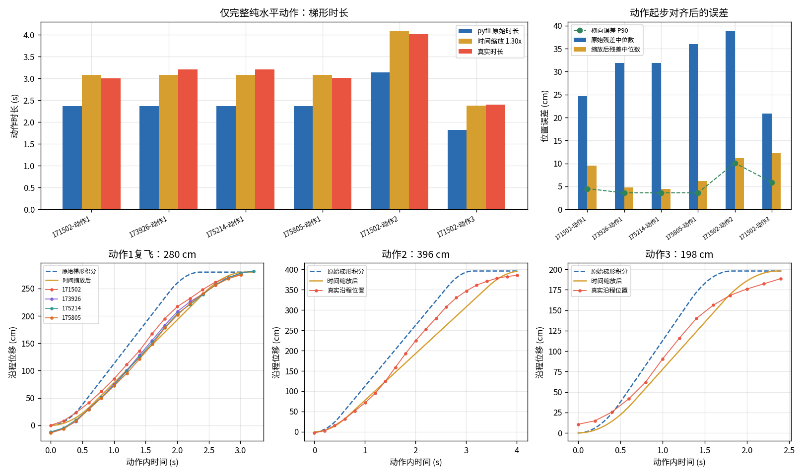

# 真实飞行轨迹、编队与定位质量：pyfii 运动模型校核

> 状态：数据驱动的技术报告。2026-07-14 已重新核对 `src/pyfii/read.py` 的理想梯形/三角速度模型、动作打断分支和 `tools/flight_log_analysis.py`；结论只适用于文中列出的采样条件，实验性时间标定尚未进入 PyFii 默认模型。
> 数据来源：`flight_logs/`（真实采集，未纳入仓库）。
> 分析脚本：[tools/flight_log_analysis.py](../tools/flight_log_analysis.py)（可复现全部图表与指标）。
> 关键指标：[doc/images/metrics.json](images/metrics.json)。
> **理想建模分析入口**：第三章“pyfii 理想建模误差分析”，核心拟合见图 11。

## 摘要

本文用真实飞行遥测校核 pyfii 的轨迹仿真，并同时分析双机编队、复飞一致性、偏航/空翻、以及 AprilTag 地毯定位质量。核心结论：

1. **模型误差只在理想建模范围内计算**：pyfii 的理想条件是上一段 `move2` 已按梯形曲线到点并减速到 `v=0`，下一段才开始。本文从同一架 `98101` 的 4 次飞行中筛出 **6 个完整、纯水平且动作边界可辨的样本**，对应 3 种位移；每段从自身真实起步时刻对齐，不使用整程全局 offset。所有打断动作、含 Z 位移动作和边界不清动作均不进入误差与拟合。
2. **AprilTag 定位数据必须先清洗**：无人机飞到一定高度后依靠底部 AprilTag 地毯定位；未识别时会输出默认位姿或错误坐标。`gpsstatus=NO_GPS` 在这里不是异常，真正要看 `fcstatus`、默认位姿、坐标越界和单帧跳变。
3. **非理想条件单独使用 pyfii 的打断分支**：下一条移动或降落指令提前到达时，pyfii 不把旧动作补到航点，而是沿旧方向以固定 `400 cm/s²` 制动到零，再从停点执行当前最新指令。该分支仍属于梯形/匀减速建模，不需要另引入 jerk 或航点融合模型。
4. **双机日志必须按 `uavid` 分组**：同一 CSV 会交错记录 98101/98102，必须先按无人机拆分，再按同一 `elapsed_ms` 对齐计算安全距离。
5. **理想模型的几何成立，时间参数存在一致偏差**：6 个合格样本的横向偏离 P90 中位数为 **4.0 cm**，说明直线路径假设较好；真实时长是原梯形时长的 **1.270-1.355 倍**。统一时间尺度 `s=1.303` 可把时长 RMSE 从 **0.745 s** 降到 **0.092 s**，动作级位置残差中位数从 **28.9 cm** 降到 **8.5 cm**。这支持增加可选的真机时间标定，但不支持改动直线梯形的几何结构。
6. **warning 必须按独立动作事件统计**：网格日志中的 **244 条 warning 是 4 个打断事件在 200 Hz 循环中逐帧重复记录**；复合航线的 **1310 条 warning 帧对应 25 个独立打断**。这些数据只用于确认非理想动作及减速分支存在，不参与理想模型误差、时间尺度拟合或制动参数标定。
7. **清洗后双机安全策略有效**：`171502` 与 `175214` 的有效编队窗口内无安全规则违例。两机 XY 接近到 1-6 cm 时，Z 差为 77-88 cm；Z 差低到 0-5 cm 时，XY 距离约 280 cm，符合“近 XY 靠高度、近高度靠平面距离”的设计。
8. **复飞一致性高，但不直接等于模型残差**：`162913`、`163106`、`180602` 三次复合航线清洗后中位 3D 差约 **4.9-8.0 cm**，90 分位约 **17.4-32.3 cm**。复飞可用于估计随机波动；由于整程混合完成与打断动作，不能用一个全局 offset 将其转换成 pyfii 模型残差。
9. **故障样本要分段使用**：`173926` 的 98101 在 `FLIP` 后出现 `z=-3925 cm` 等不可物理解释坐标；`175805` 的 98102 有 **217/279** 个 `Dead Battery` 状态、**212** 个默认位姿样本。失效后的数据不能混入正常动力学，但失效前缀可以用于安全距离、动作响应和复现性判断。

---

## 一、数据与清洗协议

### 1.1 日志清单

CSV 采样约 200 ms（5 Hz），字段包括 `uavid,x_cm,y_cm,z_cm,yaw_cdeg,fcstatus,flightmode,gpsstatus`。定位场地为底部 AprilTag 地毯；脚本坐标区间主要是 360 x 360 cm，双机脚本高度可到约 220 cm。

| 日志 | 无人机 | 用途 | 质量判断 |
|:--|:--|:--|:--|
| 162500 | 98101 | 单机网格 | 用于非理想打断机制与定位质量分析 |
| 162913 | 98101 | 复合航线：网格+螺旋+阶梯+矩形 | 用于完成/打断计数、垂直通道与复飞基准 |
| 163106 | 98101 | 同复合航线复飞 | 可用 |
| 171502 | 98101/98102 | 双机安全版舞蹈 | 可用，清洗后验证安全 |
| 173818 | 98101/98102 | 连接/起飞失败片段 | 不用于轨迹建模 |
| 173926 | 98101/98102 | 灯光+空翻故障样本 | `FLIP` 后 98101 定位失效，不用于普通轨迹建模 |
| 175214 | 98101/98102 | 灯光+空翻有效样本 | 可用，清洗后验证安全 |
| 175805 | 98101/98102 | 灯光+空翻故障样本 | 98102 `Dead Battery`，不用于正常动力学 |
| 180602 | 98101 | 复合航线复飞 | 可用 |

### 1.2 为什么必须清洗

这套无人机不是靠 GPS 定位，而是飞到一定高度后识别底部 AprilTag 地毯。因此：

- `gpsstatus=NO_GPS` 是预期状态，不代表定位失败。
- 未识别到地毯或定位状态异常时，日志可能回退到默认位姿，典型为 `(22,24,4)` 附近。
- 起降、翻滚、断电、近地丢锁会产生单帧大跳变或明显不可能坐标。
- 这些异常点不能用于速度、路径、安全距离的物理结论，但它们本身是定位质量分析的重要证据。

### 1.3 清洗规则

分析脚本将样本分成“可作为物理轨迹”与“定位质量异常”两类。用于轨迹和安全距离时，保留：

1. `flightmode == GUIDED`。
2. `fcstatus == Good`。
3. 坐标在合理范围内：约 `-100 <= x,y <= 500`、`-20 <= z <= 260`。
4. 非默认位姿：飞行开始 2 s 后，剔除 `(22,24,4)` 半径 3 cm 内的点。
5. 非单帧跳变：相邻采样位移不超过 80 cm。
6. 正常巡航分析默认剔除 `FLIP` 和 `LAND`；空翻另作特殊段分析。网格“最后一段被降落指令打断”的专项分析保留 `Good/LAND` 初始窗口，并在明显降高或状态异常后停止使用。

双机安全距离还有一个额外处理：起飞前两机都会报默认位姿，不能把这段当成真实重合。因此安全距离从“首次明显分离”（`XY > 100 cm` 或 `Z差 > 30 cm`）之后开始统计。

图 10 说明日志中存在大量定位质量事件：`175805-2`（98102）默认位姿和 `Dead Battery` 样本特别多；`173926-1`（98101）在空翻后有坐标越界和大跳变。

失败日志不是整段无用，而是按失效事件切分：

| 日志 | 无人机 | 可用前缀 | 失效事件 | 后续用途 |
|:--|:--|:--|:--|:--|
| 173818 | 98101/98102 | 无完整飞行前缀 | 98101 全程 `N/A`，98102 只报默认位姿 | 连接/起飞失败样本 |
| 173926 | 98101 | 约 42.14 s 前 | `FLIP` 后定位越界，42.74 s 首次不可物理坐标 | 空翻定位失效样本 |
| 173926 | 98102 | 到降落前基本可用 | 46.55 s 进入 `LAND` | 可辅助双机安全前缀分析 |
| 175805 | 98101 | 约 42.35 s 前 | `FLIP` 后大量 `Leaning` | 单机前缀可用，双机已不完整 |
| 175805 | 98102 | 约 12.68 s 前 | `Dead Battery` 并进入 `LAND` | 电量/默认位姿失效样本 |

因此，本文剔除的是“失效后的物理轨迹解释”，不是把失败样本全部丢掉。前缀的定量分析见 5.5。

---

## 二、pyfii 如何计算轨迹

轨迹核心在 [src/pyfii/read.py](../src/pyfii/read.py) 的 `dots2line()`。指令（`.fii`/XML）先解析为 `dots` 列表，每条 `move2` 携带 `(时刻, x, y, z, vel, acc)`，再逐帧积分为位置序列（默认 200 Hz）。

**梯形速度模型**（[read.py:272-339](../src/pyfii/read.py#L272-L339)）：

- 位移矢量 `R = sqrt(X^2 + Y^2 + Z^2)`，方向单位向量 `(X,Y,Z)/R`，即严格直线运动。
- 若距离足够，按加速、匀速、减速三段走完整梯形；距离不足则走三角速度曲线。
- 每段末端速度归零，下一段重新加速。

### 2.1 动作完成判据

对距离 `R`、最大速度 `v`、加速度 `a`，pyfii 的理想梯形/三角速度曲线所需时间为：

- 当 `R >= v²/a` 时，`T_req = R/v + v/a`。
- 当 `R < v²/a` 时，`T_req = 2 sqrt(R/a)`。

设本动作开始到下一条移动或降落指令到达的时间预算为 `T_budget`：

| 条件 | 判定 | pyfii 处理 |
|:--|:--|:--|
| 理想条件 | `T_budget >= T_req` | 完整到达目标并减速到 `v=0`，等待下一动作 |
| 非理想条件 | `T_budget < T_req` | 在下一指令到达时打断旧动作，先制动到零，再执行新动作 |

非理想分支的实际代码位于 [read.py:301-327](../src/pyfii/read.py#L301-L327) 和 [read.py:381-388](../src/pyfii/read.py#L381-L388)：

1. 检测到后续移动/降落指令时设置 `slow=True`。
2. 沿旧航段方向以固定 `400 cm/s²` 制动，制动时长约为 `v_i/400`，额外前进距离约为 `v_i²/800`。
3. 速度归零后保留实际停点，不补飞到旧目标；随后从该停点执行当时最新的一条指令。
4. `action isn't completed` 在 200 Hz 内层循环中逐帧追加，因此 warning 条数是制动帧数，不是独立动作数。若制动期间又到达多条指令，外层循环会选择最新指令，中间指令存在被跳过的可能；本次实验的指令间隔大于制动时间，没有发生这种情况。

这两种条件都以梯形速度模型为基础，但物理含义不同，不能把“理想到点”轨迹拿去评价提前打断航段。

pyfii 的水平速度/加速度经 `VelXY(v,a)` 生效；垂直通道另有表达差异。真机脚本里的 `MaxVelZ/MaxAccZ` 会生效，但 pyfii 模拟器没有解析 `VerticalSpeed`，纯竖直 `move2` 会把 `VelXY` 当垂直速度。

### 2.2 分析基线与对时

运动模型误差的入选条件同时满足：

1. pyfii 重放中，上一段位移已经到点并减速到零，当前段也在下一条位移/降落指令前完成。
2. 当前段是纯水平 `move2`，可直接使用 `VelXY/AccXY` 的梯形模型；起飞、纯竖直和 XYZ 混合位移不混入水平模型拟合。
3. 清洗后的真机轨迹能够分别识别该动作的起步和结束，不能依赖整条航线的单一时间平移猜测边界。
4. 动作窗口内没有默认位姿、坐标越界、`Dead Battery`、`FLIP` 后定位发散或 AprilTag 大跳变。

对每个入选动作 `i`，将真实起步时刻 `t0_i` 单独设为模型的 `t=0`，定义动作级位置残差：

`e_i(t) = ||p_real(t0_i+t) - p_trap,i(t)||`

真实起步取指令时刻后首次沿目标方向速度超过 `15 cm/s` 的有效采样。动作结束取首次进入目标邻域且观测到低速或转向的采样；目标邻域半径为 `max(15 cm, 6% * 动作距离)`，只有找不到该事件时才回退到窗口内最近目标点。窗口为下一指令时刻外加 `0.8 s` 在线响应余量。这个定义避免把越过目标后的回摆点误当成首次到达；约 5 Hz 采样使边界分辨率约为 `0.2 s`。模型从该动作的脚本起点出发；若模型先到目标，则余下真实动作窗口内保持在目标点。该定义既不使用整程全局 offset，也不跨动作累计相位差。横向误差另按真实点到该动作理想直线的距离计算，用于把“路径几何偏离”与“沿路径时间落后”分开。

非理想动作只统计 `completed/interrupted` 分类、独立打断事件和可观测减速现象，不计算模型残差，也不参与任何时间尺度或参数拟合。双机安全距离、垂直通道、复飞和定位质量使用各自指标，与理想水平动作误差分开。

---

## 三、pyfii 理想建模误差分析

本章是全文唯一计算 pyfii 运动模型残差并拟合模型参数的部分。输入严格限定为“上一动作完成并归零后再开始下一动作”的完整纯水平位移；非理想动作不出现在本章的任何误差、拟合或结论中。

### 3.1 理想样本筛选与几何误差

`171502-98101` 按脚本航点、`VelXY=150 cm/s`、`AccXY=300 cm/s²` 和各段等待时间重放后，共有 **9 次完整动作交接、0 次提前打断**，其中 3 段满足纯水平和边界可辨条件。同一首段 `(40,40,100) -> (40,320,100)` 还出现在 `173926`、`175214`、`175805`：`173926` 的样本早于 FLIP 定位失效，`175214` 为成功飞行，`175805` 选用状态正常的 98101，未使用失效的 98102。由此得到 **4 次飞行、6 个合格样本、3 种位移**；各动作的 `T_budget-T_req` 均为正，最小完成余量为 **0.860 s**。起飞、含 Z 位移、边界不清和所有打断动作均排除。

| 飞行/动作 | 水平位移 | 距离 | pyfii 时长 | 真实时长 | 时长比 | 3D 到点误差 | 横向误差 P90 |
|:--|:--|--:|--:|--:|--:|--:|--:|
| 171502 / 动作 1 | (40,40) -> (40,320) | 280.0 cm | 2.367 s | 3.005 s | 1.270 | 7.1 cm | 4.5 cm |
| 173926 / 动作 1 | (40,40) -> (40,320) | 280.0 cm | 2.367 s | 3.207 s | 1.355 | 2.2 cm | 3.6 cm |
| 175214 / 动作 1 | (40,40) -> (40,320) | 280.0 cm | 2.367 s | 3.208 s | 1.355 | 2.4 cm | 3.6 cm |
| 175805 / 动作 1 | (40,40) -> (40,320) | 280.0 cm | 2.367 s | 3.009 s | 1.271 | 5.9 cm | 3.6 cm |
| 171502 / 动作 2 | (40,320) -> (320,40) | 396.0 cm | 3.140 s | 4.008 s | 1.276 | 11.7 cm | 10.1 cm |
| 171502 / 动作 3 | (320,40) -> (180,180) | 198.0 cm | 1.820 s | 2.405 s | 1.321 | 12.2 cm | 5.9 cm |

六个样本的横向误差 P90 中位数为 **4.0 cm**，3D 到点误差为 **2.2-12.2 cm**。这说明真机主要沿脚本直线运动，几何路径与终点没有出现需要改换模型结构的系统性偏离。明显差异集中在沿路径的时间进度：原始梯形对所有样本都预测得更快，真实时长比模型长 **27.0%-35.5%**。动作 1 的四次重复时长均值为 **3.107 s**，极差 **0.203 s**，约等于一个遥测采样间隔；重复测量因此能估计并降低随机边界误差，但不能消除整体偏慢这一系统差异。

### 3.2 梯形时间参数拟合

令 `T_real = s * T_pyfii`，对 6 个样本作过原点的最小二乘拟合，得到统一时间尺度 `s=1.303`：

- 原始时长 RMSE：**0.745 s**。
- 时间缩放后时长 RMSE：**0.092 s**。
- 每次留出一整次飞行，用其余飞行重新拟合后预测留出样本，最大绝对时长误差为 **0.159 s**，小于一个约 5 Hz 遥测采样间隔。
- 保持同一梯形空间形状时，`s=1.303` 等价于该配置下 `v_eff=150/s=115.1 cm/s`、`a_eff=300/s²=176.6 cm/s²`。

若把标定尺度用于完成判定，`171502` 动作 2 的缩放后 `T_budget-T_req` 为 **-0.093 s**，绝对值小于约 `0.2 s` 的采样分辨率，不能据此硬判为打断。实验性 profile 应把这类动作标记为 `marginal`，而不是用单个阈值制造新的假 warning。

按 2.2 的动作级定义比较完整真实动作窗口，原始梯形的位置残差中位数/P90/RMSE 为 **28.9/50.4/33.1 cm**；使用同一 `1.303` 时间尺度后降为 **8.5/20.5/14.0 cm**。这里的下降来自校正“模型沿直线走得过快”，不是用全局时间平移追齐整条日志。汇总量包含 4 次动作 1，因而必须同时看逐动作结果：动作 2 缩放后 P90 仍有 **41.2 cm**，说明统一尺度不能解释全部控制响应、采样噪声和局部速度形状差异。遥测只有约 5 Hz，直接差分出的瞬时速度对单点抖动敏感，因此拟合使用梯形速度的沿程位置积分和动作时长，差分速度只作辅助检查。

图 11 只包含上述 6 个理想样本。上排比较动作时长和位置误差；下排将动作 1 的四次复飞叠加，并分别绘制动作 2、3 的真实沿程位置、原始梯形速度积分和时间缩放后的积分曲线。原始曲线均提前到点，缩放曲线明显贴近真实进度，但动作 2 中段仍存在可见形状差异。

因此，理想模型的结论不是“完全不改”，也不是推翻梯形模型：**直线、梯形/三角速度和到点归零的结构继续保留；时间推进可以增加可选的真机标定系数**。`1.303` 来自同一架无人机、单一 `150/300` 配置、4 次飞行中的 6 个样本，适合作为待扩大速度档位验证的硬件 profile，不应直接写成所有速度、所有无人机的全局默认值。

## 四、非理想动作与其他运动通道

### 4.1 动作未完成：下一指令提前到达

`162500` 网格的四条水平 `move2` 均只有 `2500 ms` 时间预算，按 pyfii 梯形曲线都来不及到点。pyfii 因而发生 **4 个独立动作打断**；日志中的 **244 条 warning** 是这 4 次制动在 200 Hz 循环里的重复帧，不是 244 个动作。

图 1 中蓝线只用于展示“若每段都完整到点”的几何参考，黑色虚线是本次网格实际触发的 pyfii 打断轨迹，红线是真实清洗后轨迹。四条水平动作全部位于非理想条件，因此图中的目标剩余距离、停点差或整程轨迹差都不定义为理想模型误差，也不进入 3.2 的时间尺度拟合。

图 3 为了观察机制，仅按首次持续水平运动对齐：真实约 **6.01 s**，pyfii 约 **4.08 s**。黄色区域是 pyfii 的四个强制制动窗口；第三个真实转向窗口受 AprilTag 停帧和跳变污染，其余窗口能看到转向前减速。这个对齐只服务于“是否存在减速”的定性检查，不产生位置残差或制动参数拟合。

从代码和日志可以确认：动作未完成的情况确实存在，pyfii 会沿旧方向以固定 `400 cm/s²` 制动到零，再从停点处理当前最新指令。真实数据也呈现转向前减速，但约 5 Hz 遥测没有逐条 fwfii 发包时刻，无法区分通信/控制响应延迟、未达到设定峰值速度和真实制动加速度。因此本组数据只支持保留独立的减速分支并改进事件表达，不支持修改 `400 cm/s²`，也不支持引入 jerk 或不断速航点融合模型。

### 4.2 高度与垂直速度

图 2 同样使用指令时序基线，但高度图按首次离地高度对齐：真实 `z>25 cm` 在 **4.21 s**，pyfii 基线在 **1.36 s**，offset 为 **2.85 s**。这个 offset 与速度图的 **1.94 s** 不同，说明起飞、定位恢复和水平动作开始之间不是一个刚性时间平移；这也提示动作编码与在线发送时延不能被忽略。两个整段 offset 都不进入第三章的理想动作残差，第三章对每个动作分别定位起步时刻。

真实 `Delay/WaitStable` 是发出命令后的墙钟等待，不是“等 move 完成后再计时”；因此不能把每段完整飞行时长和 Delay 简单相加。按高度通道对齐后，pyfii 基线约 **18.26 s** 落地，真实日志约 **18.04 s** 到近地，二者相差约 **0.22 s**，不足以支持“提前降落”的结论。在该通道对齐下，剩余差异主要来自近地 AprilTag 定位跳变和真实降落剖面。

阶梯航段中，真实垂直爬升速度四分位约 **20/30/40 cm/s**，并随 `MaxVelZ` 配置变化；pyfii 则用当前 `VelXY=50` 建模竖直移动，无法表达 `VelZ=30 -> 60`。另一个表达差异是：fwfii 实验脚本使用过 `z=60` 的阶梯起点，而 pyfii `Drone.move2()` 范围不接受 60 cm；复合航线的 pyfii 指令时序基线因此把该点夹到 80 cm。

实测 pyfii 语义：

| VelXY | pyfii 上升 120 cm 用时 | 等效垂直速率 |
|:--|:--|:--|
| 150 | 1.07 s | 约 150 cm/s |
| 50 | 2.42 s | 约 50 cm/s |
| 30 | 3.97 s | 约 30 cm/s |

### 4.3 复合航线与定位跳变

复合航线按指令时序重放后，pyfii 基线时长约 **68.39 s**。33 次有效动作交接中，**8 次在下一指令前完成、25 次被提前打断**；原始 warning 为 **1310 帧**。完成动作主要集中在等待时间充足的起飞、高度阶梯和短距离段，打断动作主要集中在网格、外圈螺旋和高速矩形段，因此复合航线也必须按动作分类，不能把全部 1310 帧当成同一种独立故障。

真实螺旋轨迹比理想直线段圆钝，但这里同时包含大量提前打断，不能仅凭形状推断新的动力学模型。原始日志中约 **1.8%** 的采样间速度超过 250 cm/s，最高约 **1371 cm/s**；这些点是 AprilTag 定位质量事件，不参与完成/打断速度判断。

---

## 五、编队、复飞与特殊动作

### 5.1 双机编队轨迹

清洗后，`171502` 和 `175214` 的双机轨迹都呈现清晰的分层编队：98101 主要低层，98102 主要高层。图中实线是真实轨迹，虚线是按每个动作完成/打断条件生成的 pyfii 指令时序基线。两机在中心附近会 XY 重合，但通过 Z 分层保持安全。

双机脚本同样按动作完成条件分类。`171502` 的 98101 为 **9 次完成、0 次打断**，98102 为 **8 次完成、1 次打断**（57 个 warning 帧）；`175214` 的两机均为 **9 次完成、1 次打断**（各 23 个 warning 帧）。安全距离曲线使用各自对应的模型分支生成：已完成动作走理想梯形，提前动作走制动停点分支。

### 5.2 双机安全距离

安全规则是：

- `XY < 40 cm` 时，要求 `Z差 >= 50 cm`。
- `Z差 < 50 cm` 时，要求 `XY >= 40 cm`。

图 8 的实线是真实间距，虚线是同一脚本的 pyfii 指令时序基线间距。基线与真实日志的安全规则结果如下：

| 日志 | pyfii 基线违例 | pyfii 最小裕度 | 真实清洗后违例 | 真实最小裕度 |
|:--|--:|--:|--:|--:|
| 171502 | 0 | 18.8 cm | 0 | 12.0 cm |
| 175214 | 0 | 20.0 cm | 0 | 10.0 cm |

清洗后的真实细节：

| 日志 | 有效窗口 | 违例 | 最小安全裕度 | 最近 XY | 最近 Z差 |
|:--|:--|:--|:--|:--|:--|
| 171502 | 9.42-41.48 s | 0 | 12.0 cm | XY 6.1 cm，此时 Z差 88.0 cm | Z差 4.0 cm，此时 XY 288.0 cm |
| 173926 | 10.07-41.94 s | 0 | 10.0 cm | XY 2.0 cm，此时 Z差 68.0 cm | Z差 5.0 cm，此时 XY 281.6 cm |
| 175214 | 9.68-43.35 s | 0 | 10.0 cm | XY 1.4 cm，此时 Z差 77.0 cm | Z差 0.0 cm，此时 XY 279.2 cm |
| 175805 | 9.88-12.48 s | 0 | 235.2 cm | 仅 14 个 Good 样本 | 98102 随后 Dead Battery |

结论：正常双机窗口内，安全分层策略执行有效。`175805` 只能证明故障发生前短窗口安全，不能代表完整舞蹈。

### 5.3 复飞一致性

`162913`、`163106`、`180602` 是同一复合航线的三次飞行。图 9 左侧叠加三次真实轨迹，右侧显示真实复飞之间的 3D 差。清洗后按同一日志时间比较，差异如下：

| 对比 | 中位 3D 差 | 90 分位 3D 差 | 最大 3D 差 |
|:--|:--|:--|:--|
| 162913 vs 163106 | 4.9 cm | 32.3 cm | 77.0 cm |
| 162913 vs 180602 | 7.2 cm | 17.4 cm | 42.0 cm |
| 163106 vs 180602 | 8.0 cm | 30.2 cm | 69.9 cm |

清洗后，真实轨迹在主要巡航段具有厘米级到几十厘米级的可复现性。同一程序重复飞行可以估计随机波动；对于每次都满足理想条件、且能逐动作对齐的位移，重复测量后取均值可以降低 AprilTag 随机抖动。但重复次数本身不会把被打断动作变成理想动作，也不能消除系统性时间偏差。

这三次复合航线不能直接给出 pyfii 理想模型残差：基线重放包含 **8 个完整交接和 25 个提前打断**，日志又没有逐条命令发送时间。用起飞时刻或单一 offset 对齐整条航线，会把每次打断后的累计相位差误算成空间残差。因此，这组复飞数据只用于重复性和随机误差估计；理想模型误差仍按 2.2 的条件逐动作筛选。

### 5.4 偏航与空翻

双机舞蹈中的 `Yaw(f1,'l',360)`、`Yaw(f2,'r',360)` 在 32-38 s 窗口内有稳定响应：

| 日志 | 98101 yaw 变化 | 98102 yaw 变化 |
|:--|:--|:--|
| 171502 | -315.4 deg | +324.7 deg |
| 173926 | -302.5 deg | +310.7 deg |
| 175214 | -310.9 deg | +312.7 deg |
| 175805 | -313.7 deg | 约 0 deg |

`175805` 的 98102 yaw 不响应，与其 `Dead Battery` 状态一致。`173926` 的 98101 在 `FLIP` 后坐标发散到 `x=2861,y=-1259,z=-3925` 级别，不能作为真实轨迹；它证明空翻阶段对 AprilTag 定位很不友好。`175214` 的空翻样本相对健康，但 98101 `Leaning` 状态较多，空翻仍应单独建模/标注。

### 5.5 失败样本前缀分析

`173926`、`175214`、`175805` 都是灯光+空翻类双机脚本，但脚本并非字节级相同；因此这里不把它们当作严格复飞，而是用于判断失效发生前是否已经出现轨迹/安全异常。

按首次关键失效事件切段后，前缀安全性如下：

| 日志 | 前缀窗口 | 样本数 | 安全违例 | 最小安全裕度 | 可支持的结论 |
|:--|:--|--:|--:|--:|:--|
| 173818 | 无 | 0 | - | - | 连接/起飞失败，无正常轨迹前缀 |
| 173926 | 10.07-41.94 s | 160 | 0 | 10.0 cm | `FLIP` 前双机安全规则成立 |
| 175805 | 9.88-12.48 s | 14 | 0 | 235.2 cm | 只覆盖起飞后早期分离，不能代表完整舞蹈 |

再把失败样本前缀与成功样本 `175214` 对齐比较：

| 对比 | 无人机 | 窗口 | 中位 3D 差 | 90 分位 3D 差 | 解释 |
|:--|:--|:--|--:|--:|:--|
| 173926 vs 175214 | 98101 | 10.0-41.9 s | 4.6 cm | 19.0 cm | `FLIP` 前 98101 轨迹与成功样本接近 |
| 173926 vs 175214 | 98102 | 10.0-41.9 s | 6.3 cm | 14.3 cm | 98102 前缀也正常，支持“故障集中在 98101 空翻后定位” |
| 175805 vs 175214 | 98101 | 10.0-41.9 s | 4.6 cm | 11.3 cm | 98101 即使在 98102 失效后仍基本按脚本执行 |
| 175805 vs 175214 | 98102 | 10.0-12.48 s | 6.2 cm | 23.5 cm | 98102 在 `Dead Battery` 前短窗口内仍接近成功样本 |

由此可以把失败样本分成两类结论：

1. `173926` 不是一开始就轨迹异常。它在 `FLIP` 前的安全距离、yaw 响应和轨迹前缀都接近成功样本；真正失效从 **42.14 s** 进入 `FLIP` 后开始，**42.74 s** 首次出现不可物理坐标。因此它主要说明空翻阶段会破坏 AprilTag 定位，而不是说明前序编队不安全。
2. `175805` 的 98102 也不是逐渐偏航或路径发散后失败。它在 **12.68 s** 直接进入 `Dead Battery/LAND`，而失效前 10.0-12.48 s 与成功样本的中位 3D 差约 **6.2 cm**。因此它主要是电量/状态失效样本；只有 98101 的后续轨迹可继续作为单机前缀参考，不能拿来证明双机舞蹈完整执行。

---

## 六、证据归纳

| 条件/问题 | pyfii 行为 | 真实飞行证据 | 结论 |
|:--|:--|:--|:--|
| 理想误差样本 | 完成后归零，再开始下一段 | 4 次飞行中 6 个完整、纯水平、边界可辨样本，覆盖 3 种位移 | 只有这 6 个样本进入水平模型误差与拟合 |
| 理想路径几何 | 直线梯形/三角速度 | 横向误差 P90 中位 4.0 cm，到点误差 2.2-12.2 cm | 直线和到点结构保留 |
| 理想时间进度 | 配置 `VelXY=150`、`AccXY=300` | 真实/模型时长比 1.270-1.355 | 当前理论曲线对该真机系统性偏快 |
| 理想时间标定 | 同一梯形按 `s=1.303` 拉伸 | 时长 RMSE 0.745 -> 0.092 s；位置残差中位 28.9 -> 8.5 cm | 可增加可选硬件 profile，仍需更多速度档位验证 |
| 提前打断存在性 | 沿旧方向制动，再从停点换段 | 网格 4 个打断；复合航线 25 个打断；真实转向前可见减速 | 非理想分支确实需要建模，但不参与上述误差拟合 |
| warning 语义 | 制动期间每 5 ms 追加一次 | 网格 244 帧对应 4 个事件，复合 1310 帧对应 25 个事件 | 应改为事件级输出 |
| 非理想制动参数 | 固定 `400 cm/s²` 到 `v=0` | 5 Hz 遥测可见减速，但缺命令发送时刻 | 不计算停点残差，不据此修改制动参数 |
| 垂直 | 用 VelXY，忽略 VelZ | 尊重 VelZ | 真实爬升约 20/30/40 cm/s |
| 表达范围 | pyfii `move2` 不接受 60 cm 高度 | fwfii 脚本可飞到 60 cm | 复合基线需夹到 80 cm |
| 起降 | 理想单调 | 起飞超调、近地易丢定位 | 默认位姿/跳变需清洗 |
| 复飞 | 混合完成和打断动作 | 真机可复现但有定位噪声 | 中位 3D 差 4.9-8.0 cm；只能按合格动作增加理想样本 |
| 双机 | 需按无人机对齐分析 | 清洗后可验证安全距离 | 171502/175214 无违例 |
| 定位 | 无噪声 | AprilTag 失效会回默认/错误坐标 | 175805-2 默认位姿 212 点 |
| 空翻 | 常规轨迹模型难表达 | 姿态大变化影响定位 | 173926-1 FLIP 后坐标发散 |

---

## 七、模型是否应调整

1. **保留理想模型的结构**。满足“上一段到点归零后再开始下一段”时，继续使用直线 + 梯形/三角速度 + 到点归零。合格样本的横向和终点误差不支持改用曲线航迹、jerk 或航点融合模型。
2. **为理想水平动作增加可选时间标定**。本次 `150/300` 配置可先以 `time_scale_xy=1.303` 作为实验性真机 profile。实现时应对时间参数化整体缩放，并让缩放后的 `T_req` 参与完成估计；不能只把绘图时间拉长而保持旧的完成判据。考虑当前 5 Hz 数据，`|T_budget-T_req| <= 0.2 s` 应输出 `marginal`，不强行归入 `completed/interrupted`。等价速度/加速度 `115.1/176.6` 只是该 profile 的表达，不代表已测得真机物理上限。
3. **理论默认值暂时保留**。标定覆盖 4 次飞行、6 个样本和 3 种位移，但仍只有同一架无人机、同一天和单一速度/加速度配置。留一整次飞行只能验证这些样本之间的一致性，不能替代不同无人机与速度档位的独立实验。在验证完成前，默认模拟继续使用命令参数，真机 profile 显式启用。
4. **动作未完成分支保留“先减速、后换段”**。网格和复合航线确认该情况大量存在，真实转向前也可见减速。由于这些动作超出理想误差范围，本文不以它们拟合 `400 cm/s²`，也不据此改变非理想动力学。
5. **warning 改成动作事件**。模拟输出应明确标记 `completed`、`marginal` 与 `interrupted`；每个打断事件只报告一次，并记录旧目标、下一指令时刻、完成余量、打断速度、预计制动时间、制动停点以及是否跳过中间指令。逐帧 warning 只作为内部调试计数。
6. **后续制动实验必须补齐时序观测**。只有同步记录 fwfii 指令发送/接收时刻，并提高转向窗口采样率，才能把控制响应延迟与真实制动曲线分开，再决定固定 `400 cm/s²` 是否需要标定。
7. **垂直通道独立处理**。`VelZ/AccZ` 缺失与水平动作完成判定不是同一问题，不应通过水平时间尺度或打断制动参数补偿。

最终结论是：**pyfii 可以优化，但证据支持的是在现有理想梯形结构上增加可选的真机时间标定，并改进完成/打断事件输出；现有数据不支持依据非理想动作改动理想梯形几何，也不足以修改动作未完成后的固定制动规律。**

---

## 八、复现与数据留存

- 全流程脚本：[tools/flight_log_analysis.py](../tools/flight_log_analysis.py)。
- 输出图表：`fig1..fig11` 位于 [doc/images/](images/)。
- 关键指标：[doc/images/metrics.json](images/metrics.json)。
- 原始 `flight_logs/` 不入仓库。复现需将日志放回本地 `flight_logs/`。

本文分析口径是：**理想水平模型误差只使用满足 2.2 入选条件的清洗后动作；非理想动作只作事件与机制分析；定位异常结论使用原始异常标记本身**。这能避免把 AprilTag 未识别时的默认/错误坐标误读成无人机真的飞到了那里，也避免把动作打断后的相位差误算成理想模型误差。
