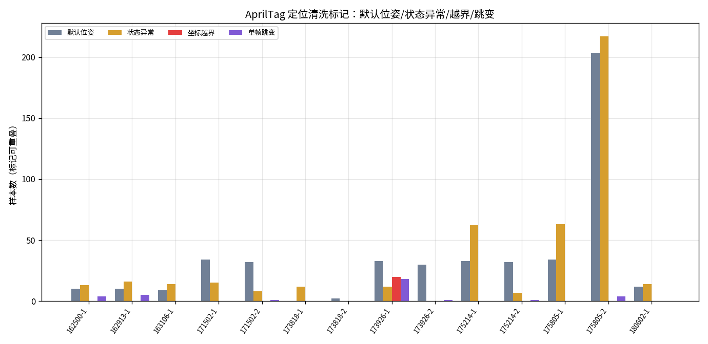
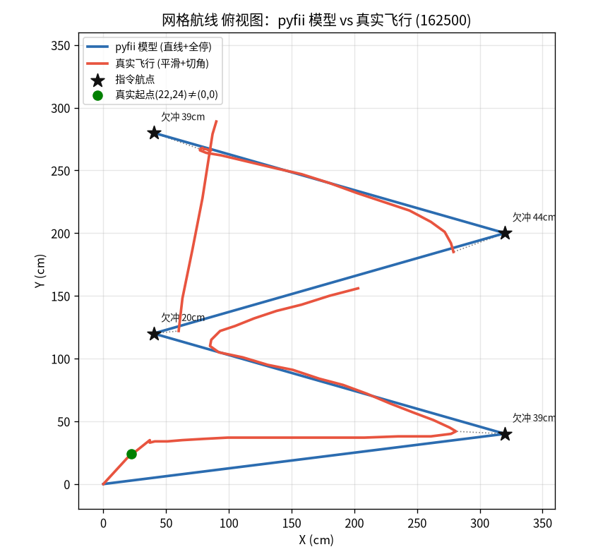
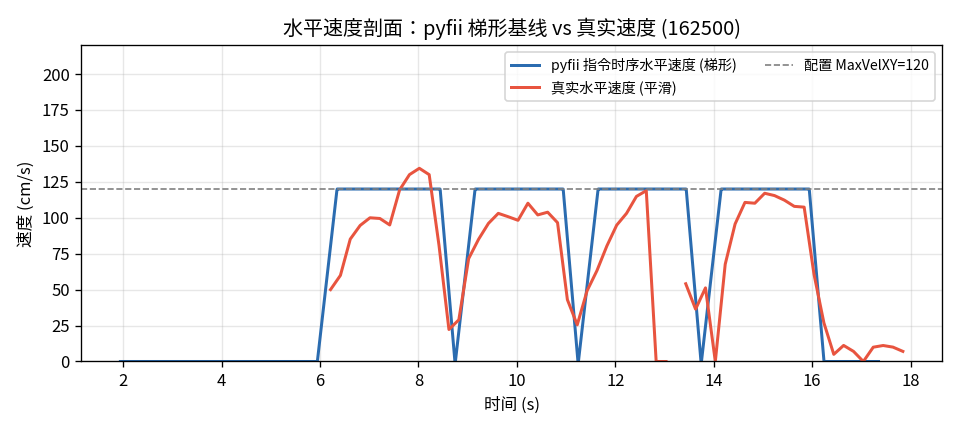
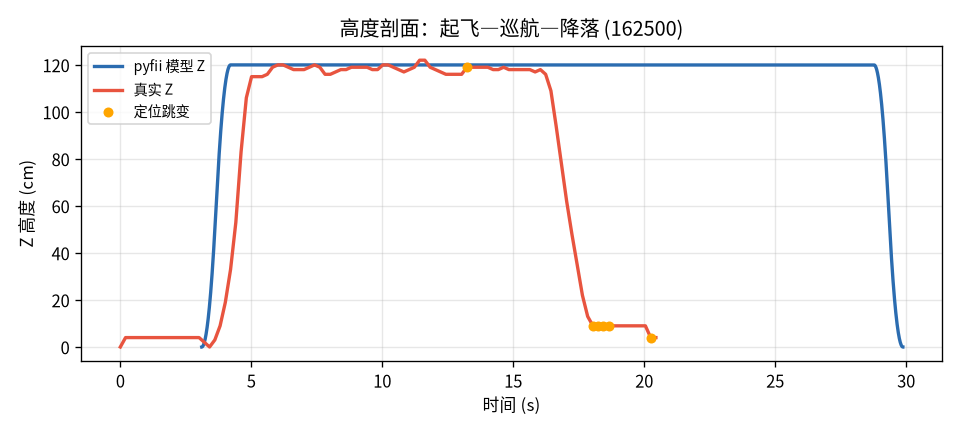
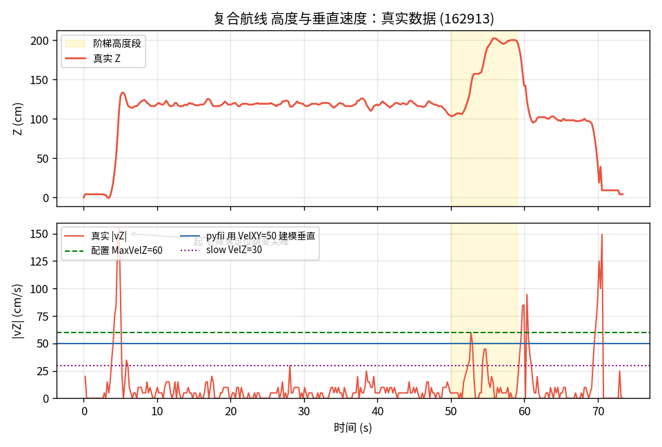
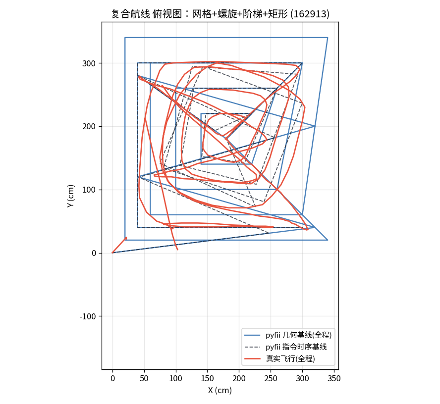
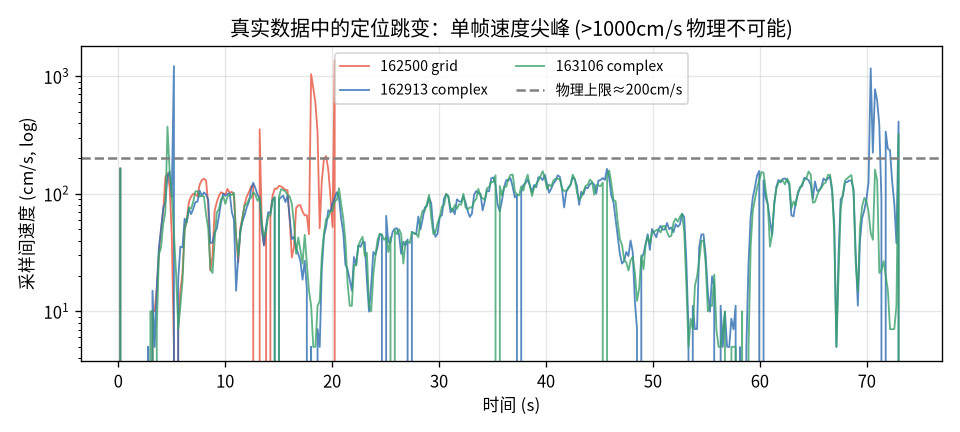
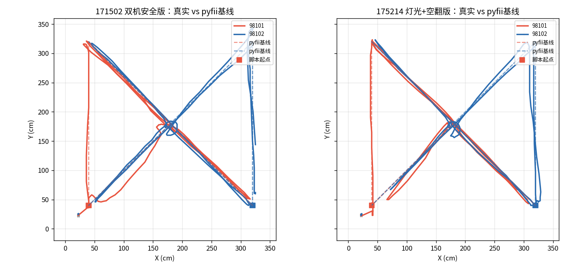
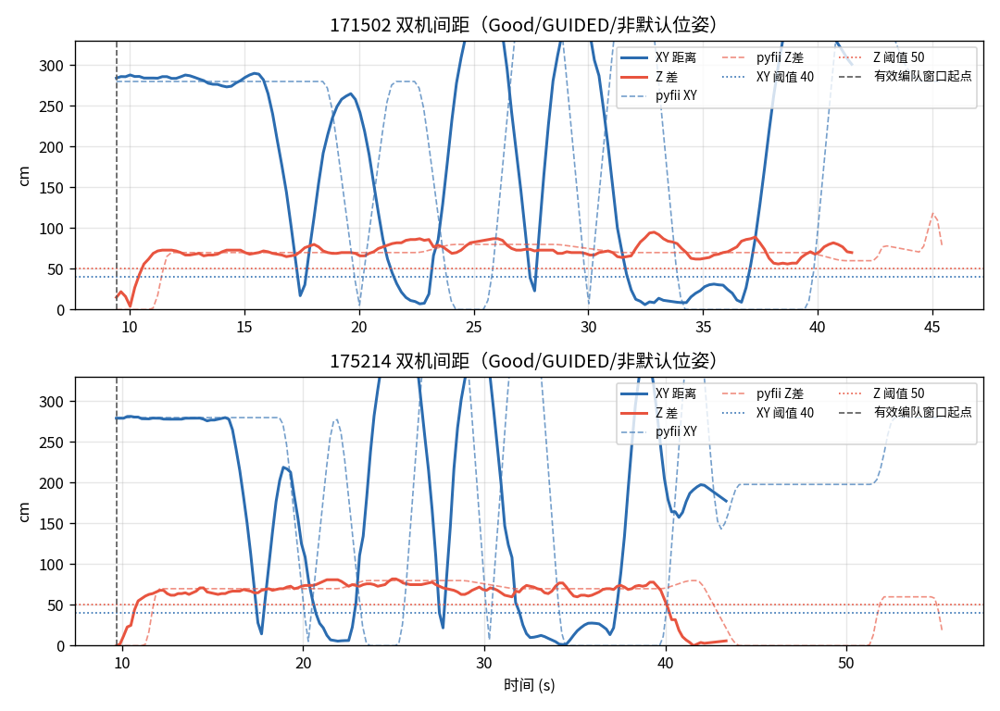
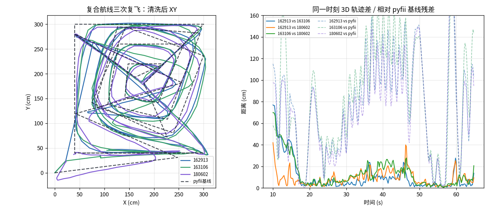

# 真实飞行轨迹、编队与定位质量：pyfii 运动模型校核

> 数据来源：`flight_logs/`（真实采集，未纳入仓库）。
> 分析脚本：[tools/flight_log_analysis.py](../tools/flight_log_analysis.py)（可复现全部图表与指标）。
> 关键指标：[doc/images/metrics.json](images/metrics.json)。

## 摘要

本文用真实飞行遥测校核 pyfii 的轨迹仿真，并同时分析双机编队、复飞一致性、偏航/空翻、以及 AprilTag 地毯定位质量。核心结论：

1. **pyfii 运动模型与真机存在系统差异**：pyfii 把 `move2` 建模为“直线 + 梯形速度 + 航点全停”，真实无人机在 ArduPilot/GUIDED 控制下表现出切角、欠冲、航点附近不全停、速度峰更圆钝等现象。网格四角平均欠冲为 **35.5 cm**，pyfii 同脚本触发 **244 次动作未完成**。
2. **AprilTag 定位数据必须先清洗**：无人机飞到一定高度后依靠底部 AprilTag 地毯定位；未识别时会输出默认位姿或错误坐标。`gpsstatus=NO_GPS` 在这里不是异常，真正要看 `fcstatus`、默认位姿、坐标越界和单帧跳变。
3. **本文采用 pyfii 梯形速度曲线作为统一分析基线**：所有清洗后可用的飞行动作，都先用 pyfii 现有“直线 + 梯形速度曲线”重放，得到指令基线；再量化真实轨迹相对基线的切角、欠冲、时序压缩、垂直速度偏差和安全裕度。由于 fwfii 在线指令没有逐条命令时间戳，速度图和高度图分别按可观测特征对齐。
4. **双机日志必须按 `uavid` 分组**：同一 CSV 会交错记录 98101/98102，必须先按无人机拆分，再按同一 `elapsed_ms` 对齐计算安全距离。
5. **动作未完成段是主要校核对象**：网格脚本在 pyfii 指令时序基线中触发 **244** 个动作未完成 warning；复合航线触发 **1310** 个 warning。真实轨迹在这些段附近表现为欠冲和不全停，因此这一类差异有实验数据支撑。
6. **清洗后双机安全策略有效**：`171502` 与 `175214` 的有效编队窗口内无安全规则违例。两机 XY 接近到 1-6 cm 时，Z 差为 77-88 cm；Z 差低到 0-5 cm 时，XY 距离约 280 cm，符合“近 XY 靠高度、近高度靠平面距离”的设计。
7. **复飞一致性高**：`162913`、`163106`、`180602` 三次复合航线清洗后中位 3D 差约 **4.9-8.0 cm**，90 分位约 **17.4-32.3 cm**。真实飞行具备可重复性，说明“相对理想基线的误差分析”有意义；但它还不足以证明应替换 pyfii 的梯形模型。
8. **故障样本不能混入正常动力学**：`173926` 的 98101 在 `FLIP` 后出现 `z=-3925 cm` 等不可物理解释坐标；`175805` 的 98102 有 **217/279** 个 `Dead Battery` 状态、**212** 个默认位姿样本。它们应作为定位/状态质量样本，而不是正常飞行轨迹样本。

---

## 一、数据与清洗协议

### 1.1 日志清单

CSV 采样约 200 ms（5 Hz），字段包括 `uavid,x_cm,y_cm,z_cm,yaw_cdeg,fcstatus,flightmode,gpsstatus`。定位场地为底部 AprilTag 地毯；脚本坐标区间主要是 360 x 360 cm，双机脚本高度可到约 220 cm。

| 日志 | 无人机 | 用途 | 质量判断 |
|:--|:--|:--|:--|
| 162500 | 98101 | 单机网格 | 用于模型对照 |
| 162913 | 98101 | 复合航线：网格+螺旋+阶梯+矩形 | 用于模型对照与复飞基准 |
| 163106 | 98101 | 同复合航线复飞 | 可用 |
| 171502 | 98101/98102 | 双机安全版舞蹈 | 可用，清洗后验证安全 |
| 173818 | 98101/98102 | 连接/起飞失败片段 | 不用于轨迹建模 |
| 173926 | 98101/98102 | 灯光+空翻故障样本 | `FLIP` 后 98101 定位失效，不用于普通轨迹建模 |
| 175214 | 98101/98102 | 灯光+空翻有效样本 | 可用，清洗后验证安全 |
| 175805 | 98101/98102 | 灯光+空翻故障样本 | 98102 `Dead Battery`，不用于正常动力学 |
| 180602 | 98101 | 复合航线复飞 | 可用 |

### 1.2 为什么必须清洗

这套无人机不是靠 GPS 定位，而是飞到一定高度后识别底部 AprilTag 地毯。因此：

- `gpsstatus=NO_GPS` 是预期状态，不代表定位失败。
- 未识别到地毯或定位状态异常时，日志可能回退到默认位姿，典型为 `(22,24,4)` 附近。
- 起降、翻滚、断电、近地丢锁会产生单帧大跳变或明显不可能坐标。
- 这些异常点不能用于速度、路径、安全距离的物理结论，但它们本身是定位质量分析的重要证据。

### 1.3 清洗规则

分析脚本将样本分成“可作为物理轨迹”与“定位质量异常”两类。用于轨迹和安全距离时，保留：

1. `flightmode == GUIDED`。
2. `fcstatus == Good`。
3. 坐标在合理范围内：约 `-100 <= x,y <= 500`、`-20 <= z <= 260`。
4. 非默认位姿：飞行开始 2 s 后，剔除 `(22,24,4)` 半径 3 cm 内的点。
5. 非单帧跳变：相邻采样位移不超过 80 cm。
6. 正常运动分析默认剔除 `FLIP` 和 `LAND`；空翻另作特殊段分析。

双机安全距离还有一个额外处理：起飞前两机都会报默认位姿，不能把这段当成真实重合。因此安全距离从“首次明显分离”（`XY > 100 cm` 或 `Z差 > 30 cm`）之后开始统计。

图 10 说明日志中存在大量定位质量事件：`175805-2`（98102）默认位姿和 `Dead Battery` 样本特别多；`173926-1`（98101）在空翻后有坐标越界和大跳变。

失败日志不是整段无用，而是按失效事件切分：

| 日志 | 无人机 | 可用前缀 | 失效事件 | 后续用途 |
|:--|:--|:--|:--|:--|
| 173818 | 98101/98102 | 无完整飞行前缀 | 98101 全程 `N/A`，98102 只报默认位姿 | 连接/起飞失败样本 |
| 173926 | 98101 | 约 42.14 s 前 | `FLIP` 后定位越界，42.74 s 首次不可物理坐标 | 空翻定位失效样本 |
| 173926 | 98102 | 到降落前基本可用 | 46.55 s 进入 `LAND` | 可辅助双机安全前缀分析 |
| 175805 | 98101 | 约 42.35 s 前 | `FLIP` 后大量 `Leaning` | 单机前缀可用，双机已不完整 |
| 175805 | 98102 | 约 12.68 s 前 | `Dead Battery` 并进入 `LAND` | 电量/默认位姿失效样本 |

因此，本文剔除的是“失效后的物理轨迹解释”，不是把失败样本全部丢掉。

---

## 二、pyfii 如何计算轨迹

轨迹核心在 [src/pyfii/read.py](../src/pyfii/read.py) 的 `dots2line()`。指令（`.fii`/XML）先解析为 `dots` 列表，每条 `move2` 携带 `(时刻, x, y, z, vel, acc)`，再逐帧积分为位置序列（默认 200 Hz）。

**梯形速度模型**（[read.py:272-339](../src/pyfii/read.py#L272-L339)）：

- 位移矢量 `R = sqrt(X^2 + Y^2 + Z^2)`，方向单位向量 `(X,Y,Z)/R`，即严格直线运动。
- 若距离足够，按加速、匀速、减速三段走完整梯形；距离不足则走三角速度曲线。
- 每段末端速度归零，下一段重新加速。

关键差异：

| 特征 | pyfii 模型 | 真机表现 |
|:--|:--|:--|
| 路径 | 直线、尖角、精确到点 | 切角、欠冲 |
| 航段连接 | 每点全停 | 多数航点不停顿通过 |
| 速度形态 | 梯形，拐点明确 | 速度峰更圆钝 |
| 垂直速度 | 没有独立 `VelZ/AccZ` 通道 | 水平/垂直控制解耦 |
| 起降 | 理想单调，速度写死 | 起飞超调、近地定位易失效 |
| 打断 | 强制减速归零并告警 | 真实轨迹表现为欠冲、切角 |

pyfii 的水平速度/加速度经 `VelXY(v,a)` 生效；真正缺的是垂直通道。真机脚本里的 `MaxVelZ/MaxAccZ` 会生效，但 pyfii 模拟器没有解析 `VerticalSpeed`，纯竖直 `move2` 会把 `VelXY` 当垂直速度。

### 2.1 统一基线用法

本文把 pyfii 梯形速度模型作为所有日志的统一分析基线。后续单机、复飞、双机编队都先生成这条理想基线，再讨论真实日志相对基线的残差：

1. 对脚本中的 `Takeoff/Move2/Land/Delay` 按 pyfii 指令时序重放，生成理想轨迹和速度曲线。
2. 将真实遥测清洗后按时间或航段对齐到这条基线。
3. 对每个动作段统计：到点欠冲、航段时长差、速度峰值差、段间是否归零、Z 轴是否受 `VelZ` 约束。
4. 对双机日志分别生成两架机的基线，再计算基线安全距离和真实安全距离。
5. 对默认位姿、坐标越界、`Dead Battery`、`FLIP` 后定位发散等样本，只做定位质量标记，不参与梯形基线拟合。

因此，本文不引入额外复杂动力学模型；所有偏差先按“真实轨迹相对 pyfii 梯形基线的残差”来描述。这样能避免把数据清洗、对时错误或脚本语义差异误写成新的飞行动力学。

需要注意的是，真实实验脚本使用的是 fwfii 在线指令；本文基线是用 pyfii API 按同一航点、速度、加速度和等待时间重放。二者的动作语义不是完全同一个编码层：例如 pyfii `takeoff(1, alt)` 带有起飞时间参数，而 fwfii `Takeoff(f, alt)` 是在线发送指令；日志里也没有逐条命令的发送时间戳。因此，时间图不能只靠一个全局 offset 解释，必须按通道选择可观测特征对齐。

这里要区分两条基线：

- **几何基线**：假设每段都完整飞到航点再进入下一段，用于看“直线到点”与真实切角的空间差异。
- **指令时序基线**：按脚本的 `Delay/WaitStable` 墙钟时序推进，下一条命令会打断未完成动作，用于看速度、高度、降落时刻和 warning。

---

## 三、单机模型对照

### 3.1 网格：直线到点 vs 平滑切角

蓝线（pyfii）精确命中四角；红线（真实清洗后主轨迹）切角通过。四角最小距离分别约 39.1、20.1、43.7、39.2 cm，均值 **35.5 cm**。

### 3.2 水平速度：梯形基线 vs 真实速度

图 3 使用 pyfii 指令时序基线的水平速度，而不是“飞完再等”的几何基线，也不把起飞/降落的垂直速度混入这一节。如果把完整飞行时间与 `Delay/WaitStable` 串行相加，理想曲线会被整体拉长，速度残差会被误读。速度图按首次持续水平运动对齐：真实日志约 **6.01 s** 出现水平运动，pyfii 基线约 **4.08 s**，对应 offset 为 **1.94 s**。

按这个水平运动 offset 对齐后，pyfii 仍是平顶梯形，真实速度仍然连续、峰值圆钝、航点附近不归零；这才是需要解释的物理差异。

把同一网格脚本喂给 pyfii 自身求解器，得到 **244 次动作未完成**，说明 `WaitStable(2500)` 对 pyfii 的“到点全停”模型不够；真实轨迹则表现为未精确到点、切角通过。

这些“动作未完成”段不能只当成报错跳过。它们表示 pyfii 在当前指令时序下认为上一段尚未按理想梯形完成；真实飞行是否应该继续按 pyfii 的“强制减速到 0”处理，必须由对应时刻的真实速度、位置残差和最小安全距离决定。当前网格日志显示，真实飞机在这些段附近没有精确到点，也没有全停，而是以欠冲方式进入下一段。

### 3.3 高度与垂直速度

图 2 同样使用指令时序基线，但高度图按首次离地高度对齐：真实 `z>25 cm` 在 **4.21 s**，pyfii 基线在 **1.36 s**，offset 为 **2.85 s**。这个 offset 与速度图的 **1.94 s** 不同，说明起飞、定位恢复和水平动作开始之间不是一个刚性时间平移；这也提示动作编码与在线发送时延不能被忽略。

真实 `Delay/WaitStable` 是发出命令后的墙钟等待，不是“等 move 完成后再计时”；因此不能把每段完整飞行时长和 Delay 简单相加。按高度通道对齐后，pyfii 基线约 **18.26 s** 落地，真实日志约 **18.04 s** 到近地，二者相差约 **0.22 s**，不足以支持“提前降落”的结论。修正对时后，剩下的差异主要来自近地 AprilTag 定位跳变和真实降落剖面。

阶梯航段中，真实垂直爬升速度四分位约 **20/30/40 cm/s**，并随 `MaxVelZ` 配置变化；pyfii 则用当前 `VelXY=50` 建模竖直移动，无法表达 `VelZ=30 -> 60`。另一个表达差异是：fwfii 实验脚本使用过 `z=60` 的阶梯起点，而 pyfii `Drone.move2()` 范围不接受 60 cm；复合航线的 pyfii 指令时序基线因此把该点夹到 80 cm。

实测 pyfii 语义：

| VelXY | pyfii 上升 120 cm 用时 | 等效垂直速率 |
|:--|:--|:--|
| 150 | 1.07 s | 约 150 cm/s |
| 50 | 2.42 s | 约 50 cm/s |
| 30 | 3.97 s | 约 30 cm/s |

### 3.4 复合航线与定位跳变

复合航线下，pyfii 的螺旋是尖角方形，真实轨迹更圆钝。按指令时序重放，复合航线 pyfii 基线时长约 **68.39 s**，并触发 **1310** 次动作未完成 warning；这说明复合航线的残差分析同样建立在 pyfii 梯形基线上，而不是只看真实轨迹形状。原始日志中有单帧速度尖峰，单机对照日志中约 **1.8%** 采样间速度超过 250 cm/s，最高约 **1371 cm/s**。这些点应视为 AprilTag 定位质量事件，而不是物理运动。

---

## 四、编队、复飞与特殊动作

### 4.1 双机编队轨迹

清洗后，`171502` 和 `175214` 的双机轨迹都呈现清晰的分层编队：98101 主要低层，98102 主要高层。图中实线是真实轨迹，虚线是 pyfii 梯形基线。两机在中心附近会 XY 重合，但通过 Z 分层保持安全。

双机脚本同样用 pyfii 指令时序重放。理想基线中，`171502` 的 98101 无动作未完成 warning、98102 有 **57** 次；`175214` 的两机各有 **23** 次。这说明后续编队数据不是脱离理想模型单独描述，而是在同一条梯形基线上比较真实轨迹、安全间距和动作未完成段。

### 4.2 双机安全距离

安全规则是：

- `XY < 40 cm` 时，要求 `Z差 >= 50 cm`。
- `Z差 < 50 cm` 时，要求 `XY >= 40 cm`。

图 8 的实线是真实间距，虚线是同一脚本的 pyfii 基线间距。理想基线与真实日志的安全规则结果如下：

| 日志 | pyfii 基线违例 | pyfii 最小裕度 | 真实清洗后违例 | 真实最小裕度 |
|:--|--:|--:|--:|--:|
| 171502 | 0 | 18.8 cm | 0 | 12.0 cm |
| 175214 | 0 | 20.0 cm | 0 | 10.0 cm |

清洗后的真实细节：

| 日志 | 有效窗口 | 违例 | 最小安全裕度 | 最近 XY | 最近 Z差 |
|:--|:--|:--|:--|:--|:--|
| 171502 | 9.42-41.48 s | 0 | 12.0 cm | XY 6.1 cm，此时 Z差 88.0 cm | Z差 4.0 cm，此时 XY 288.0 cm |
| 173926 | 10.07-41.94 s | 0 | 10.0 cm | XY 2.0 cm，此时 Z差 68.0 cm | Z差 5.0 cm，此时 XY 281.6 cm |
| 175214 | 9.68-43.35 s | 0 | 10.0 cm | XY 1.4 cm，此时 Z差 77.0 cm | Z差 0.0 cm，此时 XY 279.2 cm |
| 175805 | 9.88-12.48 s | 0 | 235.2 cm | 仅 14 个 Good 样本 | 98102 随后 Dead Battery |

结论：正常双机窗口内，安全分层策略执行有效。`175805` 只能证明故障发生前短窗口安全，不能代表完整舞蹈。

### 4.3 复飞一致性

`162913`、`163106`、`180602` 是同一复合航线的三次飞行。图 9 左侧叠加了 pyfii 指令时序基线；右侧实线是真实复飞之间的 3D 差，虚线是真实轨迹相对 pyfii 基线的残差。清洗后同一时间对齐，真实复飞之间的 3D 差异如下：

| 对比 | 中位 3D 差 | 90 分位 3D 差 | 最大 3D 差 |
|:--|:--|:--|:--|
| 162913 vs 163106 | 4.9 cm | 32.3 cm | 77.0 cm |
| 162913 vs 180602 | 7.2 cm | 17.4 cm | 42.0 cm |
| 163106 vs 180602 | 8.0 cm | 30.2 cm | 69.9 cm |

清洗后，真实动力学在主要巡航段具有厘米级到几十厘米级的可复现性。

同一程序重复飞行的作用，是估计并降低随机误差，而不是自动消除模型误差。若把多次清洗后的轨迹按相位对齐后取平均，AprilTag 随机抖动会下降；但 pyfii 理想模型与真机控制之间的系统偏差仍会保留。因此复飞数据首先用来回答两个问题：真实飞行自身有多稳定，以及真实均值相对 pyfii 基线是否存在稳定残差。

相对 pyfii 指令时序基线，三次复飞的残差如下：

| 日志 | 对齐偏移 | 相对 pyfii 中位 3D 残差 | 相对 pyfii 90 分位 3D 残差 |
|:--|--:|--:|--:|
| 162913 | 2.85 s | 77.5 cm | 137.5 cm |
| 163106 | 3.05 s | 84.4 cm | 150.3 cm |
| 180602 | 2.85 s | 71.6 cm | 126.8 cm |

这个残差显著大于真实复飞之间的差异，说明真实飞行偏离 pyfii 理想基线是稳定存在的；但残差里也包含 pyfii 表达范围（如 `z=60`）和脚本语义差异，不能直接推出某个复杂替代模型。

### 4.4 偏航与空翻

双机舞蹈中的 `Yaw(f1,'l',360)`、`Yaw(f2,'r',360)` 在 32-38 s 窗口内有稳定响应：

| 日志 | 98101 yaw 变化 | 98102 yaw 变化 |
|:--|:--|:--|
| 171502 | -315.4 deg | +324.7 deg |
| 173926 | -302.5 deg | +310.7 deg |
| 175214 | -310.9 deg | +312.7 deg |
| 175805 | -313.7 deg | 约 0 deg |

`175805` 的 98102 yaw 不响应，与其 `Dead Battery` 状态一致。`173926` 的 98101 在 `FLIP` 后坐标发散到 `x=2861,y=-1259,z=-3925` 级别，不能作为真实轨迹；它证明空翻阶段对 AprilTag 定位很不友好。`175214` 的空翻样本相对健康，但 98101 `Leaning` 状态较多，空翻仍应单独建模/标注。

---

## 五、模型残差归纳

| 维度 | pyfii 模型 | 真实飞行/日志 | 量化 |
|:--|:--|:--|:--|
| 路径形状 | 直线、尖角 | 平滑、切角 | 网格四角均欠冲 |
| 航点 | 精确命中、全停 | 欠冲、不停 | 均差 35.5 cm |
| 速度曲线 | 梯形、段末归零 | 连续、峰值圆钝 | pyfii 同脚本 244 次未完成 |
| 动作未完成 | warning 后强制减速处理 | 真实段附近欠冲、不全停 | 网格 244、复合 1310 |
| 垂直 | 用 VelXY，忽略 VelZ | 尊重 VelZ | 真实爬升约 20/30/40 cm/s |
| 表达范围 | pyfii `move2` 不接受 60 cm 高度 | fwfii 脚本可飞到 60 cm | 复合基线需夹到 80 cm |
| 起降 | 理想单调 | 起飞超调、近地易丢定位 | 默认位姿/跳变需清洗 |
| 复飞 | 模型完全确定 | 真机可复现但有定位噪声 | 中位 3D 差 4.9-8.0 cm |
| 双机 | 需按无人机对齐分析 | 清洗后可验证安全距离 | 171502/175214 无违例 |
| 定位 | 无噪声 | AprilTag 失效会回默认/错误坐标 | 175805-2 默认位姿 212 点 |
| 空翻 | 常规轨迹模型难表达 | 姿态大变化影响定位 | 173926-1 FLIP 后坐标发散 |

---

## 六、结论：保留理想基线，增加误差分析

根据现有日志，结论不是“用一个新模型替代 pyfii 的梯形模型”，而是：

1. **现有 pyfii 梯形模型应保留为默认理想基线**。它稳定、可解释、和脚本语义直接对应，适合编排设计、指令复现、碰撞检查的第一层分析。
2. **实验数据支持增加误差分析层**。清洗后的复飞数据足够稳定，说明真实偏差不是纯随机噪声；在理想基线之上统计欠冲、切角、时序压缩、垂直速度偏差等残差，是当前数据能够支撑的层级。
3. **当前数据支持的确定性修正是有限的**：区分 full-completion 几何基线和 command-timed 基线、清洗 AprilTag 定位异常、按高度/水平运动分别对齐、以及检查 `VelZ/AccZ` 是否需要进入模拟通道。若要把时间线做到命令级精度，需要在日志里记录每条 fwfii 指令的发送时间。
4. **“动作未完成”段是证据最强的校准对象**。如果多组实验都显示真实飞机在这些段稳定地欠冲、不断速到 0，pyfii 才有依据在误差分析层里改变未完成动作的解释；但这一步必须由日志残差支撑，而不是直接假设某个复杂模型。
5. **当前数据不足以证明应直接替换梯形模型**。没有高频控制量、飞控内部 setpoint 或更多标定动作支撑，直接换成更复杂的动力学模型反而可能更不科学。

因此，合理的结论是：**pyfii 飞行模拟不应放弃现有理想梯形建模；实验分析应输出真实飞行相对理想模型的偏差。** 默认模式保持理想模型，分析模式只报告有日志支撑的误差项。

---

## 七、复现与数据留存

- 全流程脚本：[tools/flight_log_analysis.py](../tools/flight_log_analysis.py)。
- 输出图表：`fig1..fig10` 位于 [doc/images/](images/)。
- 关键指标：[doc/images/metrics.json](images/metrics.json)。
- 原始 `flight_logs/` 不入仓库。复现需将日志放回本地 `flight_logs/`。

本文分析口径是：**运动模型结论只使用清洗后的物理轨迹；定位异常结论使用原始异常标记本身**。这能避免把 AprilTag 未识别时的默认/错误坐标误读成无人机真的飞到了那里。
