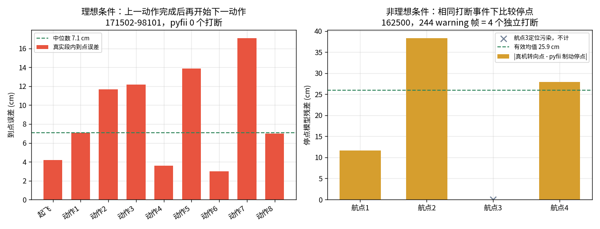
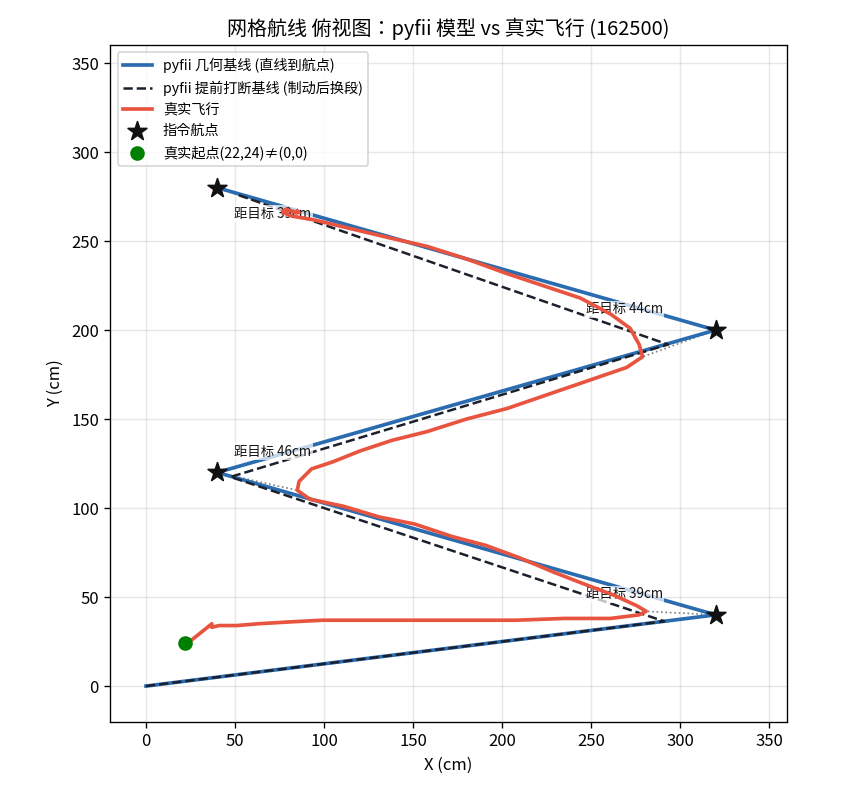
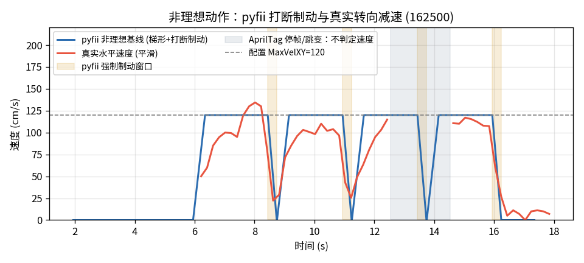
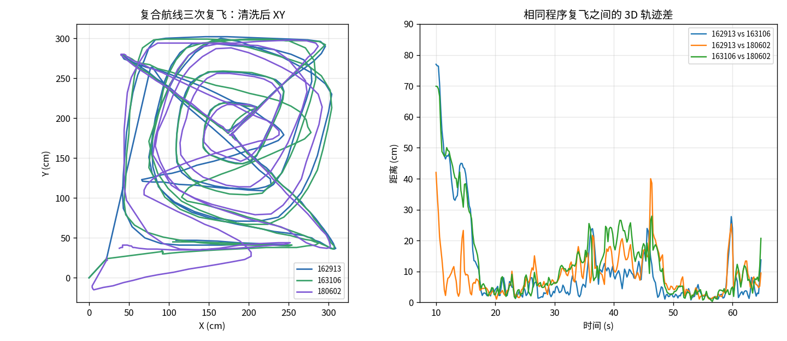

# 真实飞行轨迹、编队与定位质量：pyfii 运动模型校核

> 数据来源：`flight_logs/`（真实采集，未纳入仓库）。
> 分析脚本：[tools/flight_log_analysis.py](../tools/flight_log_analysis.py)（可复现全部图表与指标）。
> 关键指标：[doc/images/metrics.json](images/metrics.json)。

## 摘要

本文用真实飞行遥测校核 pyfii 的轨迹仿真，并同时分析双机编队、复飞一致性、偏航/空翻、以及 AprilTag 地毯定位质量。核心结论：

1. **理想条件与非理想条件必须分开**：pyfii 的理想条件是上一段 `move2` 已按梯形曲线到点并减速到 `v=0`，下一段才开始。`171502-98101` 的 pyfii 重放有 **9 次完整动作交接、0 次打断**；真机对应动作的段内 3D 到点误差中位数为 **7.1 cm**、90 分位为 **14.5 cm**，现有理想模型可继续作为默认基线。
2. **AprilTag 定位数据必须先清洗**：无人机飞到一定高度后依靠底部 AprilTag 地毯定位；未识别时会输出默认位姿或错误坐标。`gpsstatus=NO_GPS` 在这里不是异常，真正要看 `fcstatus`、默认位姿、坐标越界和单帧跳变。
3. **非理想条件单独使用 pyfii 的打断分支**：下一条移动或降落指令提前到达时，pyfii 不把旧动作补到航点，而是沿旧方向以固定 `400 cm/s²` 制动到零，再从停点执行当前最新指令。该分支仍属于梯形/匀减速建模，不需要另引入 jerk 或航点融合模型。
4. **双机日志必须按 `uavid` 分组**：同一 CSV 会交错记录 98101/98102，必须先按无人机拆分，再按同一 `elapsed_ms` 对齐计算安全距离。
5. **warning 必须按独立动作事件统计**：网格日志中的 **244 条 warning 是 4 个打断事件在 200 Hz 循环中逐帧重复记录**；复合航线的 **1310 条 warning 帧对应 25 个独立打断**。网格中 pyfii 与真机都在原航点前停止；剔除 AprilTag 污染的一次后，有效停点模型残差为 **11.6/38.3/27.9 cm**，均值 **25.9 cm**。这能确认打断场景和减速行为存在，但不能证明固定制动参数需要修改。
6. **清洗后双机安全策略有效**：`171502` 与 `175214` 的有效编队窗口内无安全规则违例。两机 XY 接近到 1-6 cm 时，Z 差为 77-88 cm；Z 差低到 0-5 cm 时，XY 距离约 280 cm，符合“近 XY 靠高度、近高度靠平面距离”的设计。
7. **复飞一致性高，但不直接等于模型残差**：`162913`、`163106`、`180602` 三次复合航线清洗后中位 3D 差约 **4.9-8.0 cm**，90 分位约 **17.4-32.3 cm**。复飞可用于估计随机波动；由于整程混合完成与打断动作，不能用一个全局 offset 将其转换成 pyfii 模型残差。
8. **故障样本要分段使用**：`173926` 的 98101 在 `FLIP` 后出现 `z=-3925 cm` 等不可物理解释坐标；`175805` 的 98102 有 **217/279** 个 `Dead Battery` 状态、**212** 个默认位姿样本。失效后的数据不能混入正常动力学，但失效前缀可以用于安全距离、动作响应和复现性判断。

---

## 一、数据与清洗协议

### 1.1 日志清单

CSV 采样约 200 ms（5 Hz），字段包括 `uavid,x_cm,y_cm,z_cm,yaw_cdeg,fcstatus,flightmode,gpsstatus`。定位场地为底部 AprilTag 地毯；脚本坐标区间主要是 360 x 360 cm，双机脚本高度可到约 220 cm。

| 日志 | 无人机 | 用途 | 质量判断 |
|:--|:--|:--|:--|
| 162500 | 98101 | 单机网格 | 用于模型对照 |
| 162913 | 98101 | 复合航线：网格+螺旋+阶梯+矩形 | 用于模型对照与复飞基准 |
| 163106 | 98101 | 同复合航线复飞 | 可用 |
| 171502 | 98101/98102 | 双机安全版舞蹈 | 可用，清洗后验证安全 |
| 173818 | 98101/98102 | 连接/起飞失败片段 | 不用于轨迹建模 |
| 173926 | 98101/98102 | 灯光+空翻故障样本 | `FLIP` 后 98101 定位失效，不用于普通轨迹建模 |
| 175214 | 98101/98102 | 灯光+空翻有效样本 | 可用，清洗后验证安全 |
| 175805 | 98101/98102 | 灯光+空翻故障样本 | 98102 `Dead Battery`，不用于正常动力学 |
| 180602 | 98101 | 复合航线复飞 | 可用 |

### 1.2 为什么必须清洗

这套无人机不是靠 GPS 定位，而是飞到一定高度后识别底部 AprilTag 地毯。因此：

- `gpsstatus=NO_GPS` 是预期状态，不代表定位失败。
- 未识别到地毯或定位状态异常时，日志可能回退到默认位姿，典型为 `(22,24,4)` 附近。
- 起降、翻滚、断电、近地丢锁会产生单帧大跳变或明显不可能坐标。
- 这些异常点不能用于速度、路径、安全距离的物理结论，但它们本身是定位质量分析的重要证据。

### 1.3 清洗规则

分析脚本将样本分成“可作为物理轨迹”与“定位质量异常”两类。用于轨迹和安全距离时，保留：

1. `flightmode == GUIDED`。
2. `fcstatus == Good`。
3. 坐标在合理范围内：约 `-100 <= x,y <= 500`、`-20 <= z <= 260`。
4. 非默认位姿：飞行开始 2 s 后，剔除 `(22,24,4)` 半径 3 cm 内的点。
5. 非单帧跳变：相邻采样位移不超过 80 cm。
6. 正常巡航分析默认剔除 `FLIP` 和 `LAND`；空翻另作特殊段分析。网格“最后一段被降落指令打断”的专项分析保留 `Good/LAND` 初始窗口，并在明显降高或状态异常后停止使用。

双机安全距离还有一个额外处理：起飞前两机都会报默认位姿，不能把这段当成真实重合。因此安全距离从“首次明显分离”（`XY > 100 cm` 或 `Z差 > 30 cm`）之后开始统计。

图 10 说明日志中存在大量定位质量事件：`175805-2`（98102）默认位姿和 `Dead Battery` 样本特别多；`173926-1`（98101）在空翻后有坐标越界和大跳变。

失败日志不是整段无用，而是按失效事件切分：

| 日志 | 无人机 | 可用前缀 | 失效事件 | 后续用途 |
|:--|:--|:--|:--|:--|
| 173818 | 98101/98102 | 无完整飞行前缀 | 98101 全程 `N/A`，98102 只报默认位姿 | 连接/起飞失败样本 |
| 173926 | 98101 | 约 42.14 s 前 | `FLIP` 后定位越界，42.74 s 首次不可物理坐标 | 空翻定位失效样本 |
| 173926 | 98102 | 到降落前基本可用 | 46.55 s 进入 `LAND` | 可辅助双机安全前缀分析 |
| 175805 | 98101 | 约 42.35 s 前 | `FLIP` 后大量 `Leaning` | 单机前缀可用，双机已不完整 |
| 175805 | 98102 | 约 12.68 s 前 | `Dead Battery` 并进入 `LAND` | 电量/默认位姿失效样本 |

因此，本文剔除的是“失效后的物理轨迹解释”，不是把失败样本全部丢掉。前缀的定量分析见 4.5。

---

## 二、pyfii 如何计算轨迹

轨迹核心在 [src/pyfii/read.py](../src/pyfii/read.py) 的 `dots2line()`。指令（`.fii`/XML）先解析为 `dots` 列表，每条 `move2` 携带 `(时刻, x, y, z, vel, acc)`，再逐帧积分为位置序列（默认 200 Hz）。

**梯形速度模型**（[read.py:272-339](../src/pyfii/read.py#L272-L339)）：

- 位移矢量 `R = sqrt(X^2 + Y^2 + Z^2)`，方向单位向量 `(X,Y,Z)/R`，即严格直线运动。
- 若距离足够，按加速、匀速、减速三段走完整梯形；距离不足则走三角速度曲线。
- 每段末端速度归零，下一段重新加速。

### 2.1 动作完成判据

对距离 `R`、最大速度 `v`、加速度 `a`，pyfii 的理想梯形/三角速度曲线所需时间为：

- 当 `R >= v²/a` 时，`T_req = R/v + v/a`。
- 当 `R < v²/a` 时，`T_req = 2 sqrt(R/a)`。

设本动作开始到下一条移动或降落指令到达的时间预算为 `T_budget`：

| 条件 | 判定 | pyfii 处理 |
|:--|:--|:--|
| 理想条件 | `T_budget >= T_req` | 完整到达目标并减速到 `v=0`，等待下一动作 |
| 非理想条件 | `T_budget < T_req` | 在下一指令到达时打断旧动作，先制动到零，再执行新动作 |

非理想分支的实际代码位于 [read.py:301-327](../src/pyfii/read.py#L301-L327) 和 [read.py:381-388](../src/pyfii/read.py#L381-L388)：

1. 检测到后续移动/降落指令时设置 `slow=True`。
2. 沿旧航段方向以固定 `400 cm/s²` 制动，制动时长约为 `v_i/400`，额外前进距离约为 `v_i²/800`。
3. 速度归零后保留实际停点，不补飞到旧目标；随后从该停点执行当时最新的一条指令。
4. `action isn't completed` 在 200 Hz 内层循环中逐帧追加，因此 warning 条数是制动帧数，不是独立动作数。若制动期间又到达多条指令，外层循环会选择最新指令，中间指令存在被跳过的可能；本次实验的指令间隔大于制动时间，没有发生这种情况。

这两种条件都以梯形速度模型为基础，但物理含义不同，不能把“理想到点”轨迹拿去评价提前打断航段。

pyfii 的水平速度/加速度经 `VelXY(v,a)` 生效；垂直通道另有表达差异。真机脚本里的 `MaxVelZ/MaxAccZ` 会生效，但 pyfii 模拟器没有解析 `VerticalSpeed`，纯竖直 `move2` 会把 `VelXY` 当垂直速度。

### 2.2 分析基线与对时

本文对每个动作先按上述判据分类，再使用对应基线：

1. **理想完成基线**：上一段完整到点并归零后开始下一段，用于分析满足时间预算的动作。
2. **非理想打断基线**：严格按脚本 `Delay/WaitStable` 的墙钟时序推进，提前到达的下一指令触发旧动作制动，用于分析动作未完成段。
3. 双机日志分别为两架机生成对应基线，再计算基线与真机的安全距离。
4. 默认位姿、坐标越界、`Dead Battery`、`FLIP` 后定位发散等样本只用于定位质量判断，不参与运动模型比较。

真实实验使用 fwfii 在线发包，而日志没有逐条命令的发送时间戳；pyfii API 重放与在线编码层也不完全相同。因此，本文不使用一个全局 offset 计算整条复合航线的模型残差。动作是否完成用“到目标剩余距离”判断；只有在完成/打断类型相同且动作交接已配对时，才计算真机状态与 pyfii 状态之差并称为模型残差。

---

## 三、理想与非理想动作模型对照

### 3.1 理想条件：上一动作完成后再开始下一动作

`171502-98101` 适合作为理想条件样本：按脚本航点、`VelXY=150 cm/s`、`AccXY=300 cm/s²` 和各段等待时间重放，pyfii 统计到 **9 次完整动作交接、0 次提前打断**。这表示每条新位移/降落指令到达前，上一段理想梯形已经到点并归零。

真机动作窗口由脚本中的 `Delay` 累积得到，并给在线指令响应保留 0.8 s 余量。9 个目标的段内 3D 到点误差中位数为 **7.1 cm**，90 分位为 **14.5 cm**，最大为 **17.1 cm**；各目标附近的最小可观测 XY 速度中位数为 **10.0 cm/s**。这里的“到点误差”是完成动作的终点精度；由于理想模型终点就是目标，它也等于终点位置残差，但不代表整段速度曲线已经完成拟合。现有数据支持保留“直线 + 梯形速度 + 到点停止”的理想定义，5 Hz 遥测仍不足以验证连续时间内是否精确到 `v=0`。

图 11 左侧统计完整动作的到点误差；右侧统计相同打断事件下真机转向点与 pyfii 制动停点之间的模型残差。两类指标定义不同，不合并求平均。

### 3.2 非理想条件：下一指令提前到达

`162500` 网格的四条水平 `move2` 均只有 `2500 ms` 时间预算，按 pyfii 梯形曲线都来不及到点。pyfii 因而发生 **4 个独立动作打断**；日志中的 **244 条 warning** 是这 4 次制动在 200 Hz 循环里的重复帧，不是 244 个动作。

图 1 中蓝线是用于说明完成条件的理想轨迹，黑色虚线是本次网格实际适用的 pyfii 打断轨迹，红线是真实清洗后轨迹。动作是否完成按各自转向窗口内“到目标剩余距离”判断，不从整段日志全局搜索航点，以免把降落后的错误坐标当成到点样本。

| 被打断动作 | 目标 XY | pyfii 距目标 | 真机距目标 | 停点模型残差 `|p_real-p_model|` | 最小可观测 XY 速度 |
|:--|:--|--:|--:|--:|--:|
| 航点 1 | (320, 40) | 29.1 cm | 39.1 cm | 11.6 cm | 22.2 cm/s |
| 航点 2 | (40, 120) | 7.9 cm | 46.1 cm | 38.3 cm | 25.5 cm/s |
| 航点 3 | (320, 200) | 27.9 cm | 43.7 cm | 15.9 cm（仅参考，不入均值） | 不判定：AprilTag 停帧/跳变 |
| 航点 4 后降落 | (40, 280) | 11.4 cm | 39.2 cm | 27.9 cm | 5.0 cm/s |

前两列“距目标”只说明两者都没有完成旧动作：pyfii 平均剩余 **19.1 cm**，真机平均剩余 **42.0 cm**。这两个数不是模型残差，更不能把真机的 42.0 cm 与理想模型的 0 cm 作误差比较。真正的非理想停点模型残差是同一打断事件下两个停点的平面距离；剔除第三次定位污染后，有效值为 **11.6、38.3、27.9 cm**，均值 **25.9 cm**。

该残差同时包含真机发包/响应时延和 pyfii 时间轴对齐误差。因为日志没有逐条命令发送时刻，只能得出“真机和 pyfii 都发生目标前减速停点，空间结果相差约二十厘米量级”，不能进一步断言 `400 cm/s²` 偏大、偏小或当前分支“偏理想”。

图 3 只比较水平速度，并按首次持续水平运动对齐：真实约 **6.01 s**，pyfii 约 **4.08 s**，offset 为 **1.94 s**。黄色区域是 pyfii 的四个强制制动窗口；第三个真实转向窗口因 AprilTag 停帧和跳变留空，不用于速度判断。其余可用窗口均观测到明显减速，但遥测只有约 5 Hz，最低观测速度不等于连续时间内的真实最低速度，因此现有数据不能严格证明真机是否恰好到 `v=0`，也不能据此标定固定 `400 cm/s²` 的制动值。

现有证据支持的是：非理想动作需要独立的减速分支，当前处理方向合理；证据不支持把它改成不断速穿越航点，也不支持引入 jerk/航点融合替代梯形模型。

### 3.3 高度与垂直速度

图 2 同样使用指令时序基线，但高度图按首次离地高度对齐：真实 `z>25 cm` 在 **4.21 s**，pyfii 基线在 **1.36 s**，offset 为 **2.85 s**。这个 offset 与速度图的 **1.94 s** 不同，说明起飞、定位恢复和水平动作开始之间不是一个刚性时间平移；这也提示动作编码与在线发送时延不能被忽略。

真实 `Delay/WaitStable` 是发出命令后的墙钟等待，不是“等 move 完成后再计时”；因此不能把每段完整飞行时长和 Delay 简单相加。按高度通道对齐后，pyfii 基线约 **18.26 s** 落地，真实日志约 **18.04 s** 到近地，二者相差约 **0.22 s**，不足以支持“提前降落”的结论。修正对时后，剩下的差异主要来自近地 AprilTag 定位跳变和真实降落剖面。

阶梯航段中，真实垂直爬升速度四分位约 **20/30/40 cm/s**，并随 `MaxVelZ` 配置变化；pyfii 则用当前 `VelXY=50` 建模竖直移动，无法表达 `VelZ=30 -> 60`。另一个表达差异是：fwfii 实验脚本使用过 `z=60` 的阶梯起点，而 pyfii `Drone.move2()` 范围不接受 60 cm；复合航线的 pyfii 指令时序基线因此把该点夹到 80 cm。

实测 pyfii 语义：

| VelXY | pyfii 上升 120 cm 用时 | 等效垂直速率 |
|:--|:--|:--|
| 150 | 1.07 s | 约 150 cm/s |
| 50 | 2.42 s | 约 50 cm/s |
| 30 | 3.97 s | 约 30 cm/s |

### 3.4 复合航线与定位跳变

复合航线按指令时序重放后，pyfii 基线时长约 **68.39 s**。33 次有效动作交接中，**8 次在下一指令前完成、25 次被提前打断**；原始 warning 为 **1310 帧**。完成动作主要集中在等待时间充足的起飞、高度阶梯和短距离段，打断动作主要集中在网格、外圈螺旋和高速矩形段，因此复合航线也必须按动作分类，不能把全部 1310 帧当成同一种独立故障。

真实螺旋轨迹比理想直线段圆钝，但这里同时包含大量提前打断，不能仅凭形状推断新的动力学模型。原始日志中约 **1.8%** 的采样间速度超过 250 cm/s，最高约 **1371 cm/s**；这些点是 AprilTag 定位质量事件，不参与完成/打断速度判断。

---

## 四、编队、复飞与特殊动作

### 4.1 双机编队轨迹

清洗后，`171502` 和 `175214` 的双机轨迹都呈现清晰的分层编队：98101 主要低层，98102 主要高层。图中实线是真实轨迹，虚线是按每个动作完成/打断条件生成的 pyfii 指令时序基线。两机在中心附近会 XY 重合，但通过 Z 分层保持安全。

双机脚本同样按动作完成条件分类。`171502` 的 98101 为 **9 次完成、0 次打断**，98102 为 **8 次完成、1 次打断**（57 个 warning 帧）；`175214` 的两机均为 **9 次完成、1 次打断**（各 23 个 warning 帧）。安全距离曲线使用各自真实分支生成：已完成动作走理想梯形，提前动作走制动停点分支。

### 4.2 双机安全距离

安全规则是：

- `XY < 40 cm` 时，要求 `Z差 >= 50 cm`。
- `Z差 < 50 cm` 时，要求 `XY >= 40 cm`。

图 8 的实线是真实间距，虚线是同一脚本的 pyfii 指令时序基线间距。基线与真实日志的安全规则结果如下：

| 日志 | pyfii 基线违例 | pyfii 最小裕度 | 真实清洗后违例 | 真实最小裕度 |
|:--|--:|--:|--:|--:|
| 171502 | 0 | 18.8 cm | 0 | 12.0 cm |
| 175214 | 0 | 20.0 cm | 0 | 10.0 cm |

清洗后的真实细节：

| 日志 | 有效窗口 | 违例 | 最小安全裕度 | 最近 XY | 最近 Z差 |
|:--|:--|:--|:--|:--|:--|
| 171502 | 9.42-41.48 s | 0 | 12.0 cm | XY 6.1 cm，此时 Z差 88.0 cm | Z差 4.0 cm，此时 XY 288.0 cm |
| 173926 | 10.07-41.94 s | 0 | 10.0 cm | XY 2.0 cm，此时 Z差 68.0 cm | Z差 5.0 cm，此时 XY 281.6 cm |
| 175214 | 9.68-43.35 s | 0 | 10.0 cm | XY 1.4 cm，此时 Z差 77.0 cm | Z差 0.0 cm，此时 XY 279.2 cm |
| 175805 | 9.88-12.48 s | 0 | 235.2 cm | 仅 14 个 Good 样本 | 98102 随后 Dead Battery |

结论：正常双机窗口内，安全分层策略执行有效。`175805` 只能证明故障发生前短窗口安全，不能代表完整舞蹈。

### 4.3 复飞一致性

`162913`、`163106`、`180602` 是同一复合航线的三次飞行。图 9 左侧只叠加三次真实轨迹，右侧只显示真实复飞之间的 3D 差，不再混入 pyfii 基线。清洗后按同一日志时间比较，差异如下：

| 对比 | 中位 3D 差 | 90 分位 3D 差 | 最大 3D 差 |
|:--|:--|:--|:--|
| 162913 vs 163106 | 4.9 cm | 32.3 cm | 77.0 cm |
| 162913 vs 180602 | 7.2 cm | 17.4 cm | 42.0 cm |
| 163106 vs 180602 | 8.0 cm | 30.2 cm | 69.9 cm |

清洗后，真实轨迹在主要巡航段具有厘米级到几十厘米级的可复现性。同一程序重复飞行可以估计随机波动；按动作相位对齐后取均值，可以降低 AprilTag 随机抖动。

这三次复合航线不能直接给出 pyfii 模型残差：基线重放包含 **8 个完整交接和 25 个提前打断**，日志又没有逐条命令发送时间。用起飞时刻或单一 offset 对齐整条航线，会把每次打断后的累计相位差误算成空间残差。因此复飞数据在本文只用于重复性和随机误差估计，不再用于证明存在某个全局模型偏差。

### 4.4 偏航与空翻

双机舞蹈中的 `Yaw(f1,'l',360)`、`Yaw(f2,'r',360)` 在 32-38 s 窗口内有稳定响应：

| 日志 | 98101 yaw 变化 | 98102 yaw 变化 |
|:--|:--|:--|
| 171502 | -315.4 deg | +324.7 deg |
| 173926 | -302.5 deg | +310.7 deg |
| 175214 | -310.9 deg | +312.7 deg |
| 175805 | -313.7 deg | 约 0 deg |

`175805` 的 98102 yaw 不响应，与其 `Dead Battery` 状态一致。`173926` 的 98101 在 `FLIP` 后坐标发散到 `x=2861,y=-1259,z=-3925` 级别，不能作为真实轨迹；它证明空翻阶段对 AprilTag 定位很不友好。`175214` 的空翻样本相对健康，但 98101 `Leaning` 状态较多，空翻仍应单独建模/标注。

### 4.5 失败样本前缀分析

`173926`、`175214`、`175805` 都是灯光+空翻类双机脚本，但脚本并非字节级相同；因此这里不把它们当作严格复飞，而是用于判断失效发生前是否已经出现轨迹/安全异常。

按首次关键失效事件切段后，前缀安全性如下：

| 日志 | 前缀窗口 | 样本数 | 安全违例 | 最小安全裕度 | 可支持的结论 |
|:--|:--|--:|--:|--:|:--|
| 173818 | 无 | 0 | - | - | 连接/起飞失败，无正常轨迹前缀 |
| 173926 | 10.07-41.94 s | 160 | 0 | 10.0 cm | `FLIP` 前双机安全规则成立 |
| 175805 | 9.88-12.48 s | 14 | 0 | 235.2 cm | 只覆盖起飞后早期分离，不能代表完整舞蹈 |

再把失败样本前缀与成功样本 `175214` 对齐比较：

| 对比 | 无人机 | 窗口 | 中位 3D 差 | 90 分位 3D 差 | 解释 |
|:--|:--|:--|--:|--:|:--|
| 173926 vs 175214 | 98101 | 10.0-41.9 s | 4.6 cm | 19.0 cm | `FLIP` 前 98101 轨迹与成功样本接近 |
| 173926 vs 175214 | 98102 | 10.0-41.9 s | 6.3 cm | 14.3 cm | 98102 前缀也正常，支持“故障集中在 98101 空翻后定位” |
| 175805 vs 175214 | 98101 | 10.0-41.9 s | 4.6 cm | 11.3 cm | 98101 即使在 98102 失效后仍基本按脚本执行 |
| 175805 vs 175214 | 98102 | 10.0-12.48 s | 6.2 cm | 23.5 cm | 98102 在 `Dead Battery` 前短窗口内仍接近成功样本 |

由此可以把失败样本分成两类结论：

1. `173926` 不是一开始就轨迹异常。它在 `FLIP` 前的安全距离、yaw 响应和轨迹前缀都接近成功样本；真正失效从 **42.14 s** 进入 `FLIP` 后开始，**42.74 s** 首次出现不可物理坐标。因此它主要说明空翻阶段会破坏 AprilTag 定位，而不是说明前序编队不安全。
2. `175805` 的 98102 也不是逐渐偏航或路径发散后失败。它在 **12.68 s** 直接进入 `Dead Battery/LAND`，而失效前 10.0-12.48 s 与成功样本的中位 3D 差约 **6.2 cm**。因此它主要是电量/状态失效样本；只有 98101 的后续轨迹可继续作为单机前缀参考，不能拿来证明双机舞蹈完整执行。

---

## 五、证据归纳

| 条件/问题 | pyfii 行为 | 真实飞行证据 | 结论 |
|:--|:--|:--|:--|
| 理想完成 | 到点并减速到零后换段 | `171502-98101` 段内 3D 到点误差中位 7.1 cm、P90 14.5 cm | 理想梯形定义保留 |
| 提前打断存在性 | 沿旧方向制动，再从停点换段 | 网格四段中 pyfii 与真机都在旧目标前转向 | 非理想分支确实需要建模 |
| 非理想停点残差 | 同一打断事件比较 pyfii 停点与真机转向点 | 有效值 11.6/38.3/27.9 cm，均值 25.9 cm | 含对时误差，不能据此修改制动参数 |
| 目标剩余距离 | 只判断旧动作是否完成 | pyfii 均值 19.1 cm，真机均值 42.0 cm | 不是模型残差，不与理想到点 0 cm 比较 |
| warning 语义 | 制动期间每 5 ms 追加一次 | 网格 244 帧对应 4 个事件，复合 1310 帧对应 25 个事件 | 应改为事件级输出 |
| 是否全停 | 模型强制到 `v=0` | 5 Hz 遥测最低见 22.2、25.5、5.0 cm/s，另一次受定位故障污染 | 数据支持减速，尚不能验证精确零速 |
| 垂直 | 用 VelXY，忽略 VelZ | 尊重 VelZ | 真实爬升约 20/30/40 cm/s |
| 表达范围 | pyfii `move2` 不接受 60 cm 高度 | fwfii 脚本可飞到 60 cm | 复合基线需夹到 80 cm |
| 起降 | 理想单调 | 起飞超调、近地易丢定位 | 默认位姿/跳变需清洗 |
| 复飞 | 不参与全局模型残差计算 | 真机可复现但有定位噪声 | 中位 3D 差 4.9-8.0 cm |
| 双机 | 需按无人机对齐分析 | 清洗后可验证安全距离 | 171502/175214 无违例 |
| 定位 | 无噪声 | AprilTag 失效会回默认/错误坐标 | 175805-2 默认位姿 212 点 |
| 空翻 | 常规轨迹模型难表达 | 姿态大变化影响定位 | 173926-1 FLIP 后坐标发散 |

---

## 六、结论：保留理想模型，修正非理想事件表达

1. **理想动作模型不改**。上一段有足够时间完成时，继续采用现有“直线 + 梯形/三角速度 + 到点归零”。`171502-98101` 的 9 个完整交接和厘米级到点误差支持把它作为理想定义。
2. **动作未完成分支暂时保留“先减速、后换段”**。网格实验确认真机也会在旧目标前减速转向，说明这一处理在行为方向上成立；现有数据既不能证明其制动参数准确，也不能证明应改成不断速航点融合或 jerk 模型。
3. **warning 改为每个打断事件只报一次**。事件至少应包含：旧动作目标、下一指令时刻、打断时到目标剩余距离、打断时速度、预计制动时间、制动停点以及是否有中间指令被跳过。逐帧 warning 数可以作为内部调试量，但不能再对外表示“动作数”。
4. **模拟输出明确标记 `completed` 与 `interrupted`**。目标剩余距离只用于完成判定；模型残差只在相同动作、相同分支和动作级对齐后计算。复合航线不得再用一个全局 offset 产生整程残差。
5. **暂不修改固定 `400 cm/s²` 制动参数**。现有日志只有约 5 Hz，且没有逐条 fwfii 发包时间，足以验证“有减速”，不足以区分响应延迟、速度未达上限和实际制动加速度。只有记录命令发送时刻并提高转向窗口采样率后，才能判断该值应保持固定、改用动作配置加速度，还是加入真机标定值。
6. **垂直速度问题独立处理**。`VelZ/AccZ` 缺失与动作打断不是同一问题，不应通过修改水平打断模型补偿。

最终结论是：**现有数据明确支持优化 pyfii 的动作完成判定输出和 warning 语义；不支持修改理想梯形模型，也不足以修改非理想分支的制动规律。当前“动作未完成后先减速”作为暂定模型保留，待命令级时序数据再决定是否校准。**

---

## 七、复现与数据留存

- 全流程脚本：[tools/flight_log_analysis.py](../tools/flight_log_analysis.py)。
- 输出图表：`fig1..fig11` 位于 [doc/images/](images/)。
- 关键指标：[doc/images/metrics.json](images/metrics.json)。
- 原始 `flight_logs/` 不入仓库。复现需将日志放回本地 `flight_logs/`。

本文分析口径是：**运动模型结论只使用清洗后的物理轨迹；定位异常结论使用原始异常标记本身**。这能避免把 AprilTag 未识别时的默认/错误坐标误读成无人机真的飞到了那里。
